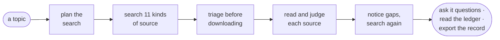
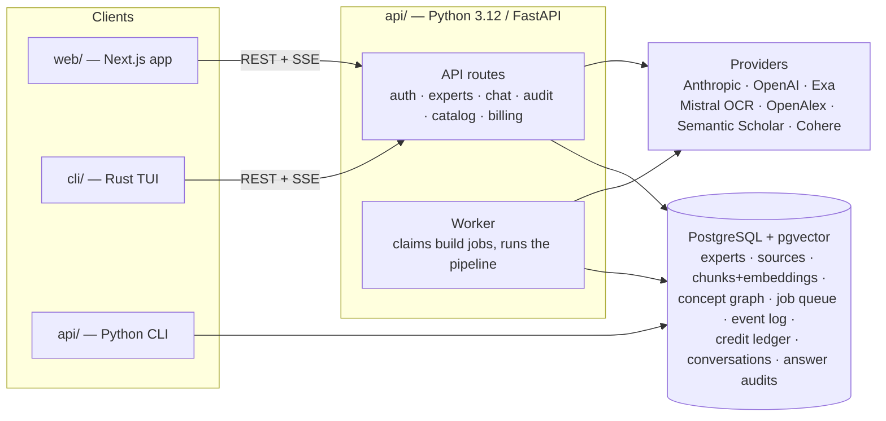

# Peritus

[](https://github.com/F0xhopper/Peritus/actions/workflows/ci.yml)
[](https://www.python.org/downloads/)
[](https://nextjs.org)

**Peritus turns a topic into a small, vetted library — and then into an expert you can question.**

Give it a topic. It plans a search strategy, runs it across eleven kinds of source, judges every
candidate against a versioned rubric, and keeps only what holds up. The survivors are chunked,
embedded, linked into a concept graph and given a persona, so you can ask them questions and get
answers with per-passage citations.

The point is not the answer at the end. The point is being able to show how the evidence behind it
was assembled — every source considered, kept or dropped, with the score and the reason.

---

## Contents

- [What it does](#what-it-does)
- [Why not just use a chatbot](#why-not-just-use-a-chatbot)
- [Architecture](#architecture)
- [Quick start](#quick-start)
- [Repository layout](#repository-layout)
- [Documentation](#documentation)
- [Development](#development)
- [Deployment](#deployment)
- [Cost and tiers](#cost-and-tiers)
- [Status](#status)

---

## What it does



1. **Plan.** Before searching anything, Claude writes a research brief: which kinds of source are
   worth searching for *this* topic, what to search for in each, and the key concepts the finished
   library has to cover. That last list becomes the standard Peritus holds itself to at the end.
2. **Search.** Eleven fetchers run concurrently — Wikipedia, Project Gutenberg, arXiv, OpenAlex,
   PubMed, PDFs from anywhere on the web, YouTube transcripts, Exa neural search, ordinary web
   search, practitioner discussion, and a curated thought-leader channel. Discovery deliberately
   over-searches, because searching is cheap and downloading is not.
3. **Triage, then fetch.** A fast model scores every candidate's title and snippet against the
   brief. Junk drops before a byte is downloaded. Only the winners get the expensive treatment
   (OCR, full-text resolution, book downloads).
4. **Validate.** Each fetched source is scored for quality and relevance against a versioned
   rubric. Every verdict — including the rejections — lands in the ledger.
5. **Close the gaps.** Accepted sources are counted against the planned key concepts. Concepts
   that came up short trigger a targeted second round, with queries written from the corpus's own
   vocabulary and citations followed backwards and forwards. Concepts still uncovered are
   *reported*, not hidden.
6. **Build the expert.** Chunk, contextualise, embed into pgvector; extract a concept graph of
   claims and how they support, contradict or qualify each other; write a persona.
7. **Ask it things.** Answers cite numbered passages. Citations are parsed and verified against
   the passage list, never trusted. Every retrieval leaves an auditable trail.

### What "judged" actually means

Every source carries a quality score, a relevance score, the rubric version used, the search that
produced it, the concepts it covers, and — if it was dropped — why. That record is queryable
(`GET /experts/{slug}/corpus-report`) and exportable as CSV or RIS, which is what Covidence and
Zotero import.

One convention carries the whole evidence surface: **a count the system did not record is `null`
with a reason, never zero.** A fabricated zero in an evidence record is worse than a visible gap.

## Why not just use a chatbot

A general model answers from weights you cannot inspect. Peritus answers from a corpus you can
read, exported as a bibliography, with the rejections attached. When it has nothing to say on
something, the coverage report says so rather than the model improvising.

It is **auditable triage for literature a database export misses** — not a systematic-review
platform, not a substitute for dual human review. It publishes no accuracy figures, because none
exist. See [docs/audit-api.md](docs/audit-api.md#claims-this-api-does-not-support) for the claims
this system explicitly does not support.

## Architecture



Everything durable lives in Postgres — there is no external vector store, queue broker or event
bus. The build queue is a table claimed with `FOR UPDATE SKIP LOCKED`; build progress is an
append-only event log that any number of clients tail over SSE; embeddings live in pgvector; credits
are an append-only ledger whose balance is `SUM(delta)`.

Builds are durable: closing your laptop mid-build changes nothing, and reconnecting replays from a
cursor. An expert becomes answerable at `chat_ready`, a full stage before its build finishes —
graph extraction and persona are enrichment, and their failure degrades the expert rather than
destroying a working corpus.

**[Read the full system walkthrough →](docs/README.md)**

## Quick start

### Prerequisites

| | |
|---|---|
| Python | 3.12+ |
| Node.js | 22+ (for the web app) |
| Rust | stable (only to build the TUI) |
| PostgreSQL | 17 with the `pgvector` extension |
| Required keys | `ANTHROPIC_API_KEY` (reasoning), `OPENAI_API_KEY` (embeddings) |
| Recommended | `COHERE_API_KEY` (reranking — cheaper *and* better than the LLM fallback) |
| Optional | `EXA_API_KEY`, `MISTRAL_API_KEY` (PDF OCR), `S2_API_KEY` |

[`just`](https://github.com/casey/just) runs the project's tasks, and
[`hivemind`](https://github.com/DarthSim/hivemind) runs the multi-process dev stack.

### Run it locally

```bash
git clone https://github.com/F0xhopper/Peritus.git
cd Peritus

# 1. Configure — every setting is documented inline in these files
cp api/.env.example api/.env     # fill in DATABASE_URL + API keys
cp web/.env.example web/.env.local

# 2. Install and migrate
cd api && pip install -e ".[dev]" && python migrations/apply.py && cd ..
cd web && npm ci && cd ..

# 3. Run — API + build worker in one process, then the web app
just dev-solo                    # http://localhost:8000
just web                         # http://localhost:3000
```

Open <http://localhost:3000>, sign in, and build your first expert. With no Supabase settings the
API runs in open dev mode (no login, every request acts as the bootstrap admin).

> **Something must run a build worker**, or builds queue forever. `just dev-solo` runs one inside
> the API process; `just dev` runs the API and worker as separate processes (production shape).

### Install the CLI only

The Python package ships the `peritus` CLI plus the `peritus-server` and `peritus-worker` entry
points:

```bash
pipx install "git+https://github.com/F0xhopper/Peritus.git#subdirectory=api"
```

Pre-built binaries of the Rust TUI are attached to
[releases](https://github.com/F0xhopper/Peritus/releases).

## Repository layout

```
api/           Python 3.12 / FastAPI — the server, build pipeline and Python CLI
  src/peritus/
    api/           FastAPI app, routes, schemas, JWT verification, rate limiting
    cli/           Python CLI (build · chat · login · experts · catalog · credits)
    experts/       build pipeline coordinator, tiers, coverage, repository
    sources/       11 fetchers, triage, validation, canonical-work resolution
    ingestion/     chunking, contextualisation, embedding
    graph/         concept-graph extraction, entity resolution, retrieval
    search/        hybrid semantic + keyword search
    chat/          grounded chat agent, grounding contract, conversations
    billing/       plans, credit ledger, spend caps
    jobs/          durable Postgres job queue and build worker
    uploads/       user-supplied PDF / text / URL sources
    eval/          offline golden-set harness and metrics
  migrations/    SQL migrations + idempotent apply.py
web/           Next.js 16 app — dashboard, chat, evidence views (see web/README.md)
cli/           Rust ratatui TUI client (see cli/README.md)
docs/          System documentation (see below)
.github/       CI, deploy and preview workflows
```

## Documentation

| Document | Covers |
|---|---|
| [docs/README.md](docs/README.md) | **Start here.** Whole-system walkthrough: what Peritus is, how an expert is built, how a question is answered, where the evidence lives |
| [docs/build-flow.md](docs/build-flow.md) | The build pipeline stage by stage: queue, worker, events, degradation |
| [docs/audit-api.md](docs/audit-api.md) | The read-only evidence record: corpus report, screening flow, coverage, contradictions, answer audits |
| [docs/api-reference.md](docs/api-reference.md) | Every HTTP endpoint, auth model, SSE streams and error shapes |
| [docs/development.md](docs/development.md) | Local setup, the task runner, tests, and the conventions that matter |
| [docs/configuration.md](docs/configuration.md) | Where settings live and the ones worth knowing about |
| [docs/deployment.md](docs/deployment.md) | Production: Fly + Vercel + Supabase, the release pipeline, secrets, rollback |
| [docs/catalog-and-credits.md](docs/catalog-and-credits.md) | The public catalog, plans, credits and build-denial payloads |
| [docs/graph-relationships.md](docs/graph-relationships.md) | The concept graph: node and edge model, extraction, resolution |
| [docs/sharing.md](docs/sharing.md) | Share links, grants and visibility |
| [docs/plans/](docs/plans/) | Design briefs, kept for their reasoning. **Not documentation** — where a plan and the code disagree, the code is right |

## Development

```bash
just dev          # API + build worker as separate processes (needs hivemind)
just dev-solo     # API with an in-process worker (single process)
just api          # API only — builds will queue but never run
just worker       # standalone build worker
just migrate      # apply database migrations

just web          # Next.js dev server
just lint         # ruff + mypy
just test         # pytest (DB-backed tests skip without a test database)
just test-db      # pytest with a scratch pgvector database — see the warning in the Justfile
just lint-web     # exactly what the web CI job runs
just e2e-web      # Playwright, all seven device projects, against the mock API
just check        # every check CI runs, except the DB tests and Rust

just build-cli    # cargo build --release
just run-cli      # the Rust TUI
```

CI runs six jobs on every pull request: the Python suite against a real pgvector service, the
production Docker image exercised the way Fly runs it, the web app's lint/typecheck/unit tests and
build, Playwright across seven device profiles, Lighthouse performance budgets, and `cargo check`.

See [docs/development.md](docs/development.md) for the longer version, and
[CONTRIBUTING.md](CONTRIBUTING.md) before opening a pull request.

## Deployment

Production runs on three platforms, released by one GitHub Actions pipeline: the web app on
**Vercel**, the API and build worker as one Docker image on **Fly.io**, and Postgres + Auth on
**Supabase** — all in London, because the database is. Nothing deploys unless CI passed.

Full detail, including secrets, rollback and known gaps: [docs/deployment.md](docs/deployment.md).

## Cost and tiers

A tier sets the depth/cost trade-off for both build and chat
(`api/src/peritus/experts/domain.py`). Note the scale: **dozens of sources, not thousands.**

| Tier | Fetch budget | Sources per concept | Subqueries | Context passages | Answer tokens | Credits | Spend cap |
|---|---|---|---|---|---|---|---|
| `lite` | 30 | 1 | 2 | 8 | 1024 | 1 | $3.00 |
| `standard` | 60 | 3 + a primary text | 4 | 15 | 2048 | 3 | $6.00 |
| `pro` | 120 | 4 + a primary text | 6 | 25 | 4096 | 8 | $12.00 |

Builds cost real money — hundreds of LLM calls. The spend cap is a hard ceiling enforced by the
meter at runtime: a build that crosses it is aborted and the credit hold refunded in full. Builds
nobody is watching route through the Anthropic Message Batches API at half price
(`BUILD_EXECUTION_DEFAULT=auto`).

**Chat is free and ungated** over anything you can read. The corpus already paid for itself.

## Status

Peritus is an actively developed personal project, deployed and in use, but pre-1.0: schemas,
endpoints and prices move. There is no payment provider — credits are issued by hand
(`peritus credits grant`) behind a provider-agnostic seam.

No licence is granted. This repository is public to be read, not to be reused; all rights are
reserved by the copyright holder. Open an issue if you want to do something with it.

Security issues: please follow [SECURITY.md](SECURITY.md) rather than opening a public issue.
