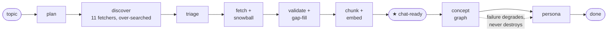
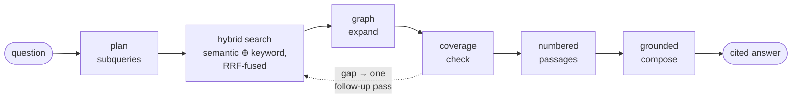

# Peritus

[](https://github.com/F0xhopper/Peritus/actions/workflows/ci.yml)

Search the literature a database export misses — and keep a record you can defend.

Give Peritus a topic. It plans a search strategy, runs it across eleven kinds of source, scores every candidate for quality and relevance against a versioned rubric, and keeps the whole ledger: what was found, what was kept, what was dropped and why, which search turned each source up, and where the surviving sources contradict each other. The survivors are embedded into a concept graph you can then question, with a citation on every claim.

The point is not the answer. The point is being able to show how the body of evidence behind it was assembled.

**Who it's for.** Researchers and analysts doing scoping reviews, rapid reviews and evidence maps, where a real part of the evidence — reports, preprints, standards, conference talks, practitioner writing — never had a bibliographic record and so never had a search anyone could document.

**What it is not.** Not a systematic-review screening platform: a build handles dozens of sources, not thousands, so keep screening your database export in Covidence or Rayyan. Not a substitute for two independent human reviewers — screening is a single model pass against a rubric, with no calibration set and therefore no published accuracy figures. Not PRISMA compliance, which is a property of your write-up and not of any tool; Peritus just happens to record the data those reports ask for. Treat its decisions as auditable triage that a human checks.

Peritus is three components:

- **`api/`**: a Python 3.12 / FastAPI server that runs the build pipeline and the retrieval-augmented chat, streaming progress and tokens over Server-Sent Events.
- **`web/`**: a Next.js dashboard — the primary interface. Browse and build experts, watch a build stream live, read the source ledger, question an expert with citations, and export the record.
- **`cli/`**: a Rust [ratatui](https://ratatui.rs) terminal UI over the same API: browse experts, kick off builds with a live log, and chat.

Storage is PostgreSQL + [pgvector](https://github.com/pgvector/pgvector). There is no external vector database; the corpus, the concept graph, and the chunk embeddings all live in Postgres.

## How it works

A whole-system overview — architecture, the build pipeline, the chat retrieval
flow, and the evidence record — lives in [docs/README.md](docs/README.md).

### Build

```
build "intermittent fasting and cardiometabolic risk"   (tier: auto · lite · standard · pro)
```

A topic is a complete request: the server derives the slug (auto-suffixing on
collision), resolves the deepest tier the account's plan and balance afford when
none is given, plans the search strategy, and names the persona. The full
walkthrough — queue, worker, every stage, readiness, and what happens when
things fail — is in [docs/build-flow.md](docs/build-flow.md).



1. **Plan**: Claude turns the topic into a tailored search query for each source fetcher and names the 5–8 core concepts the corpus must cover.
2. **Discover**: every fetcher runs concurrently — Wikipedia, Project Gutenberg, ArXiv, OpenAlex (peer-reviewed scholarship in any discipline), PubMed, PDFs (Mistral OCR), YouTube transcripts, Exa neural search, general web, Reddit, and curated thought-leaders. Discovery deliberately over-searches (3× the fetch budget, with a floor of 10 results per query) and a fast triage pass ranks candidates on title and snippet, so far more sources are considered than are ever downloaded. High-citation references of accepted scholarly sources — anything with an arXiv id or a DOI — are snowballed in via Semantic Scholar.
3. **Validate**: Claude scores each source for quality and relevance against a versioned rubric (currently `v3-concepts-q5r6`, thresholds q≥5 and r≥6) and tags it with the key concepts it substantively covers. Sources below threshold are dropped, with the reason recorded.
4. **Cover the gaps**: accepted sources are counted against the planned key concepts. Any concept with no coverage triggers a second, targeted round of searching and validation — so the corpus carries an argument for its own sufficiency rather than stopping when the budget runs out.
5. **Chunk & embed**: survivors are chunked, given Anthropic-style contextual prefixes, and embedded with OpenAI `text-embedding-3-large` (3072-dim).
6. **Graph extract**: Claude reads the chunks in batches and extracts typed concept nodes and relationships (including `contradicts` edges, which mark where the corpus disagrees with itself). Semantically duplicate nodes are then merged via embedding similarity.
7. **Persona**: Claude reads a digest of the accepted sources and the top concepts and writes a named expert persona: name, bio, and a concrete speaking/citation style.

### The ledger

Every source the build considered is persisted in the `sources` table, kept or dropped, with:

| Column | What it records |
|--------|-----------------|
| `quality_score`, `relevance_score` | 0–10 each, from the validation pass |
| `passed`, `drop_reason` | The decision, and the stated reason when it was a rejection |
| `validator_model`, `rubric_version` | Which model judged it, under which rubric — so a decision can be re-read in context |
| `discovered_via` | How it entered the corpus: `plan`, `snowball`, or `gapfill:<concept>` |
| `covered_concepts` | Which of the planned key concepts it substantively covers |
| `content_type`, `difficulty`, `key_claims` | Classification and up to five central claims |

This is the part that matters: `discovered_via` records *which search produced this source*, including whether it exists only because a named concept was still uncovered. That is the search-strategy half of an evidence report — the half grey literature has no tooling for.

The ledger is written on every build, streamed live as the build runs (each keep/drop appears in the build log with its scores and reason), and readable back afterwards:

| Endpoint | Returns |
|----------|---------|
| `GET /experts/{slug}/sources` | The per-source rows — every source considered, kept or dropped, with scores, drop reason, validator model, rubric version, discovery path and concept coverage |
| `GET /experts/{slug}/corpus-report` | Corpus composition, concept coverage, and where the corpus contradicts itself |
| `GET /experts/{slug}/corpus-report/export?format=csv\|ris` | The same ledger as CSV, or as RIS for import into Zotero / EndNote |

RIS is there because a grey-literature source Peritus found has no bibliographic record to import from anywhere else — see [POSITIONING.md](POSITIONING.md) for where this is going next.

### Chat

Each question is answered through a grounded retrieval loop:



1. **Plan** subqueries from the question.
2. **Hybrid search** every subquery in parallel: semantic (pgvector) fused with keyword (Postgres full-text) via reciprocal-rank fusion, then optionally reranked (Cohere cross-encoder, or a windowed LLM fallback).
3. **Graph expand** the hits with neighbouring concepts and relationships from the concept graph.
4. **Coverage check**: Claude judges whether the retrieved passages answer the question and, if not, suggests follow-up queries for a second retrieval pass.
5. **Compose**: the deduplicated passages are numbered and handed to Claude under a strict grounding contract: answer only from the passages, cite every claim with its `[n]`.
6. **Stream** the answer token-by-token, then resolve the citation list down to only the passages the answer actually cited.

## Tiers

A tier sets the depth/cost trade-off for both build and chat (`api/.../experts/domain.py`):

| Tier     | Sources | Subqueries | Graph hops | Context passages | Response tokens |
|----------|---------|-----------|-----------|------------------|-----------------|
| lite     | ~10     | 2         | 1         | 8                | 1024            |
| standard | ~20     | 4         | 1         | 15               | 2048            |
| pro      | ~40     | 6         | 2         | 25               | 4096            |

Note the scale: dozens of sources, not thousands. Peritus is a discovery-and-appraisal tool for material that has no bibliographic record, not a screening tool for a large database export. A build also costs real money — hundreds of LLM calls, roughly a couple of dollars at pro tier — which is what the tier dial is really for. Builds route through the Anthropic Message Batches API by default (`ANTHROPIC_BATCH_ENABLED`), halving cost at the price of wall-clock time.

## Requirements

- Python 3.12+
- Rust (stable), only needed to build the TUI client
- PostgreSQL with the `pgvector` extension
- `ANTHROPIC_API_KEY`: validation, graph extraction, persona, chat
- `OPENAI_API_KEY`: embeddings
- Optional: `EXA_API_KEY` (Exa neural search + YouTube discovery), `MISTRAL_API_KEY` (PDF OCR), `COHERE_API_KEY` (cross-encoder reranking)

## Install

The Python package (the `peritus` CLI plus `peritus-server` and `peritus-worker`) installs with [pipx](https://pipx.pypa.io):

```bash
pipx install "git+https://github.com/F0xhopper/Peritus.git#subdirectory=api"
```

To pin a release, install from a tag instead:

```bash
pipx install "git+https://github.com/F0xhopper/Peritus.git@v2.0.0#subdirectory=api"
```

Pre-built binaries of the Rust TUI are attached to [releases](https://github.com/F0xhopper/Peritus/releases); to work on Peritus itself, follow the setup below.

## Setup

```bash
# 1. Configure
cp api/.env.example api/.env    # then fill in DATABASE_URL + API keys

# 2. Install the API and apply migrations
cd api
pip install -e .
python migrations/apply.py

# 3. Build the Rust TUI client
cd ../cli
cargo build --release
```

Key environment variables (`api/src/peritus/core/config.py`):

| Variable               | Purpose                                            | Default                      |
|------------------------|----------------------------------------------------|------------------------------|
| `DATABASE_URL`         | Postgres connection string                         | -                            |
| `ANTHROPIC_API_KEY`    | Claude (validation, graph, persona, chat)          | -                            |
| `OPENAI_API_KEY`       | Embeddings                                         | -                            |
| `CLAUDE_MODEL`         | Chat + persona model                               | `claude-sonnet-5`            |
| `PLAN_MODEL`           | Search planning (falls back to `CLAUDE_MODEL`)     | `CLAUDE_MODEL`               |
| `FAST_MODEL`           | Triage, validation, contextualisation, coverage    | `claude-haiku-4-5-20251001`  |
| `GRAPH_MODEL`          | Graph extraction                                   | `claude-haiku-4-5-20251001`  |
| `EMBED_MODEL` / `EMBED_DIM` | OpenAI embedding model / dimension            | `text-embedding-3-large` / `3072` |
| `EXA_API_KEY`          | Exa + YouTube discovery (optional)                 | -                            |
| `MISTRAL_API_KEY`      | PDF OCR (optional)                                 | -                            |
| `COHERE_API_KEY`       | Cross-encoder reranking (optional)                 | -                            |
| `SUPABASE_URL`         | Supabase project URL; set it to require login      | -                            |
| `SUPABASE_ANON_KEY`    | Anon/publishable key (server-side only, for OTP proxy) | -                        |
| `SUPABASE_JWT_SECRET`  | Legacy HS256 secret (only if not on JWKS signing keys) | -                        |
| `BOOTSTRAP_ADMIN_EMAIL`| Admin email; sees pre-auth (owner-less) experts   | -                            |
| `PERITUS_ENV`          | `production` refuses to start with auth disabled (fail-closed) | `development`     |
| `AUTH_ALLOW_SIGNUP`    | `false` = invite-only (unknown emails can't self-provision) | `true`              |
| `AUTH_RATE_LIMIT` / `AUTH_RATE_WINDOW` | Per-IP cap on `/auth/otp` + `/auth/verify` (requests / seconds) | `10` / `60` |
| `CORS_ALLOW_ORIGINS`   | Comma-separated browser origins allowed by CORS    | `http://localhost:3000,http://localhost:8000` |
| `PERITUS_API_KEY_HASH` | SHA-256 of a legacy static API key (superseded by Supabase auth) | -              |

## Running

The repo ships a `Justfile` with the common commands:

```bash
just dev-solo     # API server + in-process build worker (single-process local dev)
just dev          # API server only (uvicorn, :8000, --reload)
just worker       # standalone build worker (production shape: run beside `just dev`)
just migrate      # apply database migrations
just test         # pytest
just lint         # ruff + mypy
just build-cli    # cargo build --release
just run-cli      # cargo run  (the TUI)
just docker-up    # docker compose up --build -d  (api + worker services)
just docker-down
```

Builds execute in a durable Postgres-backed job queue, so *something* must run a
worker: either `just dev-solo` (worker inside the API process) or `just dev` plus
`just worker` as two processes.

Typical flow: start the server (`just dev-solo`), then launch the TUI (`just run-cli`). On first run the TUI shows a config screen; point it at the server URL (default `http://localhost:8000`). If the server has auth enabled, the TUI then shows a sign-in screen (see below). From the home screen you can create an expert (topic + tier) and watch the build log live, then open it to chat.

## Authentication

Peritus uses [Supabase Auth](https://supabase.com/docs/guides/auth). Users sign in with an **email one-time code** (no passwords, no browser, works entirely in the terminal), and every expert is owned by the user who built it. Each user sees and chats with only their own experts.

**How it fits together.** The API is a backend-for-frontend: it holds the Supabase anon key and proxies the sign-in calls, so clients only ever handle the resulting session tokens. Access tokens (JWTs) are verified locally against the project's **JWKS endpoint** (asymmetric ES256/RS256 signing keys, the current Supabase default), falling back to the legacy HS256 shared secret if that's all the project has. See `api/src/peritus/api/auth.py`.

**Enable it** by setting `SUPABASE_URL`, `SUPABASE_ANON_KEY`, and `BOOTSTRAP_ADMIN_EMAIL` (plus `SUPABASE_JWT_SECRET` only if the project hasn't migrated to signing keys). With none of these set, the server runs in **open dev mode**: no login required, and requests act as the admin. **In production, set `PERITUS_ENV=production`**: the server then refuses to start with auth disabled, so a missing `SUPABASE_URL` can never silently drop every request into admin mode.

**One-time Supabase setup:** in the dashboard, set the *Magic Link* email template to send a code; include `{{ .Token }}` in the template (a 6-digit code) rather than only a magic link, since the TUI verifies the code directly.

**Open vs. invite-only.** By default anyone who can reach the server can sign in and gets their own private workspace (`AUTH_ALLOW_SIGNUP=true`). To run Peritus as an invite-only workspace, set `AUTH_ALLOW_SIGNUP=false` and add users from the Supabase dashboard; unknown emails then can't self-provision. The `/auth/otp` and `/auth/verify` endpoints are also per-IP rate-limited (`AUTH_RATE_LIMIT` / `AUTH_RATE_WINDOW`).

**Sign in from the TUI:** enter your email → receive a code by email → enter the code. The session (access + rotating refresh token) is saved to the client config with `0600` permissions and refreshed automatically; press `L` on the home screen to sign out. Signing out (TUI `L` or `peritus logout`) revokes the session server-side, so the refresh token can't be reused.

**Sign in from the Python CLI:**

```bash
peritus login          # prompts for email, then the 6-digit code
peritus whoami         # show the signed-in user
peritus logout         # revoke the session server-side + clear the local cache
```

Experts built with `peritus build` are owned by the signed-in user; experts that predate auth (owner-less rows) are visible to `BOOTSTRAP_ADMIN_EMAIL`.

> A legacy static key (`PERITUS_API_KEY_HASH` + `Authorization: Bearer <key>`) is still accepted as a fallback credential, but Supabase login is the recommended path.

## API

When auth is enabled, expert endpoints require a Supabase access token via `Authorization: Bearer <token>`; the `/auth/*` endpoints are public (they *are* the login flow).

| Method   | Path                      | Description                                  |
|----------|---------------------------|----------------------------------------------|
| `GET`    | `/health`, `/ready`       | Liveness / DB readiness                       |
| `GET`    | `/auth/status`            | Whether this server requires login            |
| `POST`   | `/auth/otp`               | Send an email one-time code                    |
| `POST`   | `/auth/verify`            | Exchange a code for a session                  |
| `POST`   | `/auth/refresh`           | Rotate a refresh token for a new session       |
| `POST`   | `/auth/logout`            | Revoke the caller's session (refresh tokens)   |
| `GET`    | `/auth/me`                | The current authenticated user                 |
| `GET`    | `/experts`                | List the caller's experts                     |
| `GET`    | `/experts/{slug}`         | Expert detail (persona, key concepts, counts, source-type breakdown) |
| `POST`   | `/experts/build`          | Build an expert (**SSE** stream of progress)  |
| `GET`    | `/experts/{slug}/build/events?after=N` | Reconnect to a build's progress from a cursor (**SSE**) |
| `GET`    | `/experts/{slug}/build/status` | Point-in-time build job status            |
| `POST`   | `/experts/{slug}/build/cancel` | Cancel the active build                   |
| `DELETE` | `/experts/{slug}`         | Delete an expert (cancels any in-flight build) |
| `POST`   | `/experts/{slug}/chat`    | Ask a question (**SSE** stream of tokens + citations) |

## Project layout

```
api/
  src/peritus/
    api/          FastAPI app, routes (incl. /auth), schemas, JWT verification
    cli/          Python CLI (build/chat + login/logout/whoami)
    experts/      build pipeline coordinator, tiers, repository (owner-scoped)
    sources/      fetchers (wikipedia, arxiv, exa, web, …) + candidate triage + Claude validator
    ingestion/    chunking, contextualisation, embed pipeline
    graph/        concept-graph extraction, storage, retrieval
    search/       hybrid semantic + keyword search service
    chat/         grounded chat agent, grounding contract, faithfulness
    eval/         offline golden-set harness + retrieval/answer metrics
    infrastructure/  Postgres pool, embeddings, reranker, Anthropic client, PDF OCR
  migrations/     SQL migrations + apply.py
cli/
  src/
    api/          HTTP + SSE client
    tui/          ratatui screens (home, build, chat, config, login) and widgets
    config/       on-disk client config (server URL + saved session)
```
