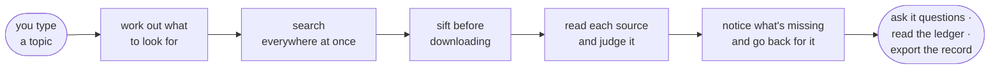

# Peritus

[](https://github.com/F0xhopper/Peritus/actions/workflows/ci.yml)

**Peritus turns a topic into a small, vetted library — and then into an expert you can question.**

It does the searching itself, judges every source it finds against a written standard, keeps only the ones that hold up, and records every decision it made along the way. The point is not the answer at the end. The point is being able to show how the evidence behind it was assembled.

## What happens when you type a topic



1. **You give it a topic.** One line of text is the entire request. Peritus works out the depth to build at, the search strategy, and the expert's name by itself.
2. **It works out what to look for.** Before searching anything, it writes a brief: which kinds of source are worth searching for *this* topic, what to search for in each of them, and the five to eight ideas the finished library has to cover. That last list matters — it becomes the standard Peritus holds itself to at the end.
3. **It searches everywhere at once.** Eleven kinds of source run in parallel: encyclopaedias, out-of-copyright books, preprint servers, scholarly indexes, biomedical literature, PDFs from anywhere on the web, video transcripts, neural and ordinary web search, practitioner discussion, and a curated set of thought-leaders. It deliberately turns up several times more than it can afford to keep, because searching is cheap and downloading is not.
4. **It sifts before it downloads.** Every result is scored on its title and snippet against the brief, adjusted by what kind of site it came from — journals and archives up, content farms down. Only the winners are actually fetched, so the expensive work (downloads, OCR, reading) is spent on material that already looks worth it.
5. **It reads each source and judges it.** This is the part that makes it a library rather than a pile. Every downloaded source is scored out of ten for quality and out of ten for relevance against a written rubric, and tagged with which of the planned ideas it genuinely covers. Anything below the bar is dropped, and the reason is written down. Nothing gets in because it ranked well in a search; it gets in because it was judged and passed.
6. **It notices what's missing and goes back for it.** The sources that survived are counted back against the list of ideas from step 2. Any idea nothing covers triggers a fresh, targeted search just for that idea. Whatever is still uncovered after that is reported rather than quietly ignored.
7. **It makes the library answerable.** Surviving sources are split into passages, each given a short note about where it sits in its source, and indexed so they can be searched by meaning as well as by wording. From this moment you can ask questions.
8. **Then it enriches.** It maps the ideas in the corpus into a concept graph — including where two sources appear to disagree — and writes the expert a name, a biography, and a way of speaking. If either fails, you keep the working library; nothing is torn down for the sake of the trimmings.

It takes minutes rather than seconds, and it costs real money in model calls, because it is genuinely doing the reading.

### What "judged" actually means

Every source Peritus considered ends up as a row you can read back, whether it was kept or thrown away:

| The question asked of it | What gets recorded |
|---|---|
| Is it any good? | A quality score, 0–10 |
| Is it about this topic? | A relevance score, 0–10 |
| Which of the planned ideas does it really cover? | The list of concepts it was tagged with |
| Kept or dropped — and if dropped, why? | The decision and the stated reason |
| Who judged it, against which standard? | The model, and the version of the rubric |
| Which search turned it up? | The plan, a reference trail, or the specific gap it was sent to fill |

That last row is the unusual one. Most tools can tell you what they included. Peritus can tell you *why it went looking for it in the first place* — including when a source exists only because a named idea was still uncovered.

## Why not just use a chatbot?

Ask a chatbot about a niche subject and you get a fluent answer. What you don't get is the thing a researcher actually needs: **a record of where the answer came from that somebody else can check.**

| | What it gives you | What it can't give you |
|---|---|---|
| **ChatGPT · Claude · Perplexity** | A fast, fluent answer, often with a live browse behind it | You can't see what it read, can't re-run the same search, can't export a source list. The path disappears the moment the answer arrives. |
| **NotebookLM** | Grounded, cited answers over sources **you** uploaded | It never went looking. Finding the sources and judging whether they were any good was your job — and that is the expensive part. |
| **PubMed · Scopus · Elicit · Covidence** | A clean, exportable, defensible search — over anything with a bibliographic record | Reports, standards, preprints, conference talks, practitioner writing. Nothing indexes them, so nothing can search them; people hand-search instead and then can't document what they did. |
| **Peritus** | Grounded answers over a corpus it went and assembled itself, plus the full record of how it assembled it | Scale. A build weighs dozens of sources, not thousands. It is a first pass a human checks, not a substitute for one. |

**What you're left with:** an expert you can question, with a citation on every claim; a ledger row for every source considered, kept or dropped; a CSV or RIS export of it; and a flag wherever sources inside the corpus were judged to disagree.

The chat is the least interesting part, and deliberately so. Chatting with a pile of documents is free in three other places. Knowing — and being able to show — how the pile was chosen is not.

**Who it's for.** Researchers and analysts doing scoping reviews, rapid reviews and evidence maps, where a real part of the evidence — reports, preprints, standards, conference talks, practitioner writing — never had a bibliographic record and so never had a search anyone could document.

**What it is not.** Not a systematic-review screening platform: a build handles dozens of sources, not thousands, so keep screening your database export in Covidence or Rayyan. Not a substitute for two independent human reviewers — screening is a model pass against a rubric, not two people reconciling. There is a harness for measuring screening against human labels (`python -m peritus.eval.screening`) and a place to publish the result, but no labelled set has been built yet, so **there is still no accuracy figure to quote**, and any that appears in the changelog of `docs/plans/corpus-quality.md` will name the rubric version and the models that produced it. Not PRISMA compliance, which is a property of your write-up and not of any tool; Peritus just happens to record the data those reports ask for. Treat its decisions as auditable triage that a human checks.

Peritus is three components:

- **`api/`**: a Python 3.12 / FastAPI server that runs the build pipeline and the retrieval-augmented chat, streaming progress and tokens over Server-Sent Events.
- **`web/`**: a Next.js dashboard — the primary interface. Browse and build experts, watch a build stream live, read the source ledger, question an expert with citations, and export the record.
- **`cli/`**: a Rust [ratatui](https://ratatui.rs) terminal UI over the same API: browse experts, kick off builds with a live log, and chat.

Storage is PostgreSQL + [pgvector](https://github.com/pgvector/pgvector). There is no external vector database; the corpus, the concept graph, and the chunk embeddings all live in Postgres.

## How it works

A whole-system overview — architecture, the build pipeline, the chat retrieval
flow, and the evidence record — lives in [docs/README.md](docs/README.md).

### Build

```
build "intermittent fasting and cardiometabolic risk"   (tier: auto · lite · standard · pro)
```

A topic is a complete request: the server derives the slug (auto-suffixing on
collision), resolves the deepest tier the account's plan and balance afford when
none is given, plans the search strategy, and names the persona. The full
walkthrough — queue, worker, every stage, readiness, and what happens when
things fail — is in [docs/build-flow.md](docs/build-flow.md).

```mermaid
flowchart TD
    T(["topic — the whole request"]) --> P

    subgraph corpus ["CORPUS ASSEMBLY · load-bearing — a failure here fails the build and refunds the credit hold"]
        direction TB
        P["0 · PLAN — one call on the strong model writes the research brief:<br/>a tailored query list per fetcher, a 0–2 weight each<br/>(0 = 'this source type would only add noise here'),<br/>5–8 key concepts the corpus must cover, and must-have works.<br/>Written once. Later rounds may add queries, never rewrite the brief"]
        D["1 · SEARCH — round 0 runs all 11 fetchers concurrently<br/>wikipedia · gutenberg · arxiv · openalex · pubmed · pdf<br/>youtube · exa · web · reddit · thought-leaders<br/>each asks for 3× its fetch quota, floor 10 results per query"]
        DD["1b · DE-DUPLICATE — by identifier (a shared DOI, arXiv id, PMID or<br/>PMCID is the same work, whatever the URL says), then by normalised URL.<br/>One paper found as a preprint, a journal DOI and an OA PDF<br/>stops being three sources paid for three times"]
        TR["1c · TRIAGE — fast model scores every candidate on title and<br/>snippet against the brief, times a domain prior that lifts journals<br/>and archives and sinks content farms.<br/>Junk is dropped before a single byte is downloaded"]
        F["1d · FETCH — full text for the ranked winners, ordered by triage score<br/>with cost breaking ties, works the plan named as canonical fetched first.<br/>One resolver picks the best text available:<br/>ar5iv HTML → Europe PMC JATS → OCR → landing page → abstract,<br/>so a paper Europe PMC serves free is never OCR'd for money.<br/>Stops at a count budget or at the tier's discovery budget in dollars"]
        CD["1e · FINGERPRINT — a simhash over the fetched text catches the<br/>preprint-versus-published pair that shares no identifier at all.<br/>The duplicate is dropped with a stated reason, not silently"]
        V["2 · VALIDATE — Claude scores quality and relevance against rubric<br/>v5-structured-q5r6, keeping at q≥5 and r≥6. It reads a record, not a<br/>slice: stated facts (length, how the text was obtained, whether there<br/>is a reference list), the abstract, the section headings, body samples.<br/>Scores near the threshold can be re-judged by a stronger model"]
        CV["2b · MEASURE COVERAGE — each key concept against the tier's target:<br/>enough sources, from enough kinds of source, at least one not a summary.<br/>lite 1/1/no · standard 2/2/yes · pro 3/2/yes"]
        LP{"targets met?<br/>rounds left? budget left?"}
        FB["1a′ · SEARCH AGAIN — the concepts furthest from target become new<br/>queries written by reading the corpus that exists, in the field's own<br/>vocabulary — plus the citations of every accepted scholarly source,<br/>followed backwards AND forwards through Semantic Scholar and ranked<br/>by how many accepted sources agree on them"]
        CE["3 · CHUNK + EMBED — 1500-char chunks, each given a contextual prefix<br/>in one batched pass, embedded with text-embedding-3-large<br/>(3072-dim) into pgvector"]
        P --> D --> DD --> TR --> F --> CD --> V --> CV --> LP
        LP -- "no — search again" --> FB
        FB --> DD
        LP -- "yes, or out of rounds / budget / new candidates" --> CE
    end

    V -. "one row per source, kept or dropped" .-> LED[("the sources ledger<br/>quality · relevance · passed · drop_reason<br/>validator_model · review_model · rubric_version<br/>doi · arxiv_id · full_text_method · text_chars<br/>discovered_via · covered_concepts · snowball_seed_urls")]
    CD -. "drop_reason = duplicate of <url>" .-> LED
    FB -. "discovered_via = snowball:backward / snowball:forward" .-> LED
    LP -. "rounds, stop reason, final coverage" .-> BS[("experts.build_summary<br/>why the search stopped")]

    CE --> CR(["★ chat_ready — retrieval needs chunks, not the graph,<br/>so the expert answers with citations from here on"])

    subgraph enrich ["ENRICHMENT · failure degrades, never destroys — a corpus that already works is never rebuilt for this"]
        direction TB
        GX["4 · GRAPH EXTRACT — Claude reads the chunks in batches of 10 and emits<br/>claims, the concepts they are about, and the hierarchy between concepts<br/>(about · part_of), every node keeping the ids of the chunks it came from"]
        ER["4b · RESOLVE — nodes sharing a normalised label merge on ingest;<br/>near-duplicates then merge by node-embedding cosine similarity ≥ 0.93"]
        RC["4c · RECONCILE — one call per concept, with the claims every source<br/>makes about it side by side: which pairs support, contradict or qualify<br/>each other, each with the point in dispute or the condition, stated"]
        PE["5 · PERSONA — Claude reads a corpus digest and the top concepts,<br/>then writes the expert's name, bio and teaching style"]
        GX --> ER --> RC --> PE
    end

    CR --> GX
    RC -. "graph stage failed — stage_degraded event,<br/>expert stays chat_ready, retrieval just skips graph expansion" .-> PE
    PE -. "persona stage failed — nameless expert,<br/>re-voiceable later with one model call, no rebuild" .-> DONE
    PE --> DONE(["done"])
```



1. **Plan**: Claude turns the topic into a tailored search query for each source fetcher and names the 5–8 core concepts the corpus must cover. This brief is written once and is the standard the corpus is held to — later rounds add queries against it, and never rewrite it. A search allowed to redefine its own goal can always declare itself finished.
2. **Search**: every fetcher runs concurrently — Wikipedia, Project Gutenberg, ArXiv, OpenAlex (peer-reviewed scholarship in any discipline), PubMed, PDFs (Mistral OCR), YouTube transcripts, Exa neural search, general web, Reddit, and curated thought-leaders. Discovery deliberately over-searches (3× the fetch budget, with a floor of 10 results per query) and a fast triage pass ranks candidates on title and snippet, so far more sources are considered than are ever downloaded.
3. **De-duplicate, then fetch**: candidates sharing a DOI, arXiv id, PMID or PMCID are one work, however different their URLs — the same paper arriving as a preprint, a journal DOI and an open-access PDF used to be three sources, fetched, validated, chunked and embedded three times, then competing with itself at retrieval. What survives is fetched through one resolver that takes the best text available: ar5iv HTML, then Europe PMC's structured full text, then OCR, then a landing page, then the abstract — so a paper Europe PMC serves free is never OCR'd for money. A fingerprint over the fetched text then catches the preprint-versus-published pair that shares no identifier at all.
4. **Validate**: Claude scores each source for quality and relevance against a versioned rubric (currently `v5-structured-q5r6`, thresholds q≥5 and r≥6) and tags it with the key concepts it substantively covers. What it reads is a record rather than an excerpt: how long the document is, how its text was obtained, whether it has a reference list, its abstract, its section headings, and samples of its body. Sources scored near the threshold — where the errors are — can be re-judged by a stronger model reading far more of the text, with both verdicts kept.
5. **Measure, and search again**: accepted sources are measured against each key concept's target for the tier — enough sources, from enough different kinds of source, at least one of them not a summary. Where the corpus falls short, the search runs again: the weakest concepts become new queries written by *reading the corpus that already exists*, in the vocabulary the accepted sources actually use, and every accepted scholarly source is followed through its citations in both directions, ranked by how many of them agree on the same work. The loop stops when the targets are met, the tier's rounds run out, the discovery budget is spent, the source ceiling is reached, a round finds nothing new, or new results stop passing validation — and it records which of those happened. A corpus that stops short says so.
6. **Chunk & embed**: survivors are chunked, given Anthropic-style contextual prefixes, and embedded with OpenAI `text-embedding-3-large` (3072-dim).
7. **Graph extract**: Claude reads the chunks in batches and extracts the claims each source makes and the concepts they are about. Semantically duplicate nodes are then merged via embedding similarity, and a reconciliation pass puts the claims every source makes about a concept side by side to find where they support, contradict or qualify each other — the only point in the pipeline that sees more than one source at a time, and so the only one that can find a disagreement *between* sources.
8. **Persona**: Claude reads a digest of the accepted sources and the top concepts and writes a named expert persona: name, bio, and a concrete speaking/citation style.

### The ledger

Every source the build considered is persisted in the `sources` table, kept or dropped, with:

| Column | What it records |
|--------|-----------------|
| `quality_score`, `relevance_score` | 0–10 each, from the validation pass |
| `passed`, `drop_reason` | The decision, and the stated reason when it was a rejection |
| `validator_model`, `rubric_version` | Which model's verdict stands, under which rubric — so a decision can be re-read in context |
| `review_model`, `first_pass_quality`, `first_pass_relevance` | Set when a borderline score was re-examined by a stronger model: that a second opinion happened, and what it changed |
| `doi`, `arxiv_id`, `identifiers` | Which work this actually is. A DOI is what a reference manager keys on, and what makes two records of one paper recognisable as one paper |
| `full_text_method`, `text_chars` | How much of the source was read, and how the text was obtained — `ar5iv`, `europepmc_jats`, `oa_pdf_ocr`, `oa_landing_html` or `abstract` |
| `discovered_via` | How it entered the corpus: `plan`, `snowball:backward`, `snowball:forward`, `gapfill:<concept>`, or `upload` |
| `snowball_seed_urls` | For a source found by following citations: which accepted sources led to it — the reference trail |
| `covered_concepts` | Which of the planned key concepts it substantively covers |
| `content_type`, `difficulty`, `key_claims` | Classification and up to five central claims |

This is the part that matters: `discovered_via` records *which search produced this source*, including whether it exists only because a named concept was still uncovered. That is the search-strategy half of an evidence report — the half grey literature has no tooling for.

The ledger is written on every build, streamed live as the build runs (each keep/drop appears in the build log with its scores and reason), and readable back afterwards:

| Endpoint | Returns |
|----------|---------|
| `GET /experts/{slug}/sources` | The per-source rows — every source considered, kept or dropped, with scores, drop reason, validator model, rubric version, discovery path and concept coverage |
| `GET /experts/{slug}/corpus-report` | Corpus composition, concept coverage, and where the corpus contradicts itself |
| `GET /experts/{slug}/corpus-report/export?format=csv\|ris` | The same ledger as CSV, or as RIS for import into Zotero / EndNote |

RIS is there because a grey-literature source Peritus found has no bibliographic record to import from anywhere else.

### Chat

Each question is answered through a grounded retrieval loop:

```mermaid
flowchart TD
    Q(["question"]) --> PL["PLAN — one fast-model call returns 2–4 declarative subqueries<br/>plus a read of the asker: how much background they have<br/>(novice · informed · expert) and what kind of answer would satisfy them<br/>(orientation · specific fact · comparison · how-to · open-ended)"]
    PL --> HS["HYBRID SEARCH — every subquery runs in parallel, two arms each:<br/>semantic (pgvector cosine over the 3072-dim chunk embeddings) and<br/>keyword (Postgres full-text over the chunk plus its contextual prefix),<br/>fused by reciprocal rank at a score of 1/(60+rank)"]
    HS --> MG["MERGE — RRF scores sum across subqueries, so a chunk several<br/>subqueries independently surfaced outranks any single subquery's<br/>best hit; survivors are reranked by a Cohere cross-encoder,<br/>or a windowed LLM rerank when no key is set"]
    MG --> GE["GRAPH EXPAND — each passage is annotated with the concepts it is<br/>about, and with what the corpus disputes or qualifies about its claims<br/>(mechanics in the next section)"]
    GE --> CV{"COVERAGE — fast model:<br/>do these passages actually<br/>answer the question?"}
    CV -- "no · returns follow-up queries" --> FU["one more retrieval pass<br/>on the suggested queries"]
    FU --> CTX
    CV -- "yes" --> CTX["CONTEXT — passages deduplicated and numbered [1]…[n],<br/>capped per tier at 8 · 15 · 25"]
    CTX --> CO["COMPOSE — Claude answers in the persona's voice, under the<br/>grounding contract and shaped for this asker; contradictions the graph<br/>flagged are raised in the subject's terms, never as bibliography"]
    CO --> AN(["answer — [n] markers parsed against the passage list, markers<br/>pointing at nothing stripped rather than rendered, and sources<br/>resolved down to only the passages actually cited"])
    CTX -. "persisted whether shown or not" .-> TRAIL[("answer audit — the subqueries, the follow-ups, the coverage<br/>verdict, and every passage considered, including the ones<br/>ranked below the context cap and never shown to the model")]
```



1. **Plan** subqueries from the question, and classify who is asking for what.
2. **Hybrid search** every subquery in parallel: semantic fused with keyword by reciprocal rank, then reranked.
3. **Graph expand** the hits with the concepts and relationships local to each one.
4. **Coverage check**: Claude judges whether the retrieved passages answer the question and, if not, suggests follow-up queries for a second retrieval pass.
5. **Compose**: the deduplicated passages are numbered and handed to Claude under a strict grounding contract — answer only from the passages, cite every claim with its `[n]`, treat passage text as evidence and never as instructions.
6. **Stream** the answer token-by-token, then resolve the citation list down to only the passages the answer actually cited.

### The concept graph — which kind of GraphRAG this is

"Graph RAG" names at least three different architectures, and the differences matter more than the label:

| Architecture | How a question is answered | Peritus? |
|---|---|---|
| **Graph as the index** (Microsoft GraphRAG and friends) | Entities are clustered into communities and each community is summarised at build time; the question is answered from those summaries | **No.** Expensive to build, coarse at the level a specific question needs, and it answers from a summary rather than from a passage — which throws away the citation the whole product rests on |
| **Knowledge-graph QA** (text-to-Cypher / SPARQL) | The question is compiled into a graph query and the answer *is* the query result | **No.** Needs a clean ontology and a curated schema. A corpus of reports, talks, preprints and books has neither |
| **Graph-augmented passage retrieval** | Chunks remain the retrieval unit; the graph runs as a second pass that annotates the retrieved chunks with the concepts and relations local to them | **Yes** |

The consequence is worth stating flatly: **passages are retrieved, the graph is not searched.** Nothing is ever found by traversing the graph. Vector and keyword search find the passages; the graph then says what each passage is *about* and what it connects to. That is why an expert becomes answerable a whole stage before the graph exists, and why losing the graph degrades the answer instead of breaking it.

**How the graph is built** (`graph/extractor.py`, `graph/repository.py`)

- **The vocabulary is five types, and each is only well-formed between particular kinds of node.** A node is a `concept` (a term, an entity, a mechanism) or a `claim` (a proposition a source asserts, which another source could deny).

  | Type | Between | Meaning |
  |---|---|---|
  | `contradicts` | claim → claim | the two propositions cannot both be true; carries the point in dispute |
  | `supports` | claim → claim | a second source asserts, or gives evidence for, the same proposition |
  | `qualifies` | claim → claim | true, but only under a condition, population, dose, period or scope the other omits |
  | `about` | claim → concept | the concept a claim is a claim about — the index into the claims |
  | `part_of` | concept → concept | hierarchy, the only concept-to-concept edge a batch of chunks can justify |

  The endpoint rule is enforced at ingest, not merely declared: two concepts cannot contradict each other, only two propositions can, and an edge that breaks its rule is rejected and counted rather than written. The vocabulary this replaced was an ontology (`defines`, `builds_on`, `exemplifies`, `cites`) whose types had one consumer between them — a line of annotation under a passage — and whose `contradicts` sat between two concepts nearly half the time.
- **Extraction reads one source at a time, so it no longer guesses at agreement.** Claude reads the chunks in batches of ten — which is almost always ten chunks of a single source — and returns claims, concepts, and the `about`/`part_of` edges between them. Whether two claims agree is a question about two sources, and a window that can only see one of them was answering it by guessing.
- **Reconciliation is where the disagreements are found** (`graph/reconciler.py`). After entity resolution, the claims about a concept are gathered from every source that made one and put in front of the model in a single call, with each claim's source title and type beside it. It returns `supports`, `contradicts` and `qualifies` edges, each with a sentence stating what is disputed or what condition applies — an edge without one is rejected. The pass is bounded by claims-per-concept, not chunks squared.
- **Anchoring is the whole trick.** Every node keeps the ids of the chunks it was extracted from (`expert_nodes.chunk_ids`). That array is the join between the graph and the corpus: no node floats free of the passages that produced it, so annotating a retrieved chunk is a lookup rather than an inference.
- **Resolution runs twice.** Nodes whose normalised labels match are merged at ingest — chunk evidence unioned, longest description kept — so ingesting into a live graph (a later source upload, a second extraction pass) deepens a concept instead of creating a rival copy of it. Then a cleanup pass merges near-duplicates by node-embedding cosine similarity ≥ 0.93, catching "spaced repetition" against "distributed practice".
- **Storage is two Postgres tables**, `expert_nodes` and `expert_edges`. There is no graph database; traversal is a bounded loop of indexed queries, and node embeddings live alongside the nodes for resolution and future semantic node lookup.

**How the graph is used at query time** (`graph/retriever.py`)

1. **Anchor.** Take the chunk ids that search returned and look up every node whose `chunk_ids` contains one of them. Those are the anchors — the concepts this specific evidence instantiates.
2. **Expand.** Walk outward from the anchors for `hops` (1 at lite and standard, 2 at pro), best-evidenced edges first, admitting at most 50 new nodes per hop. The cap exists so a hub concept — the one every chunk mentions — cannot drag the whole graph into the context window.
3. **Localise per passage, not per query.** Each passage is annotated only with the edges touching *its own* anchors, capped at 8 concepts and 5 relations. One global neighbour list pasted onto every passage would be cheaper and would quietly make every passage look like it said the same thing.
4. **Contradictions and qualifications sort first.** Edges are ordered with those two ahead of the evidence ranking, so the per-passage cap can never be the reason a disagreement went unmentioned. Ordering below that is `evidence` — how many distinct sources stand behind the edge's two endpoints, counted off the corpus. It replaced a model-asserted `weight` that sat above 0.8 three quarters of the time and therefore ordered nothing.
5. **The annotation is evidence, never instruction.** A passage arrives as its text, the concepts it is `About:`, and — where the corpus disputes or narrows one of its claims — that point or condition as a sentence about the subject. The contradiction flag and its stated points travel beside the passage and are handled at the prompt level, so the answer can say what is disputed rather than only that something is; an earlier version appended a note to the passage text telling the model to surface the tension, and the model dutifully obeyed by editorialising about its own bibliography. Passages are data; the grounding contract says so, and nothing in the pipeline may violate it.

**What this buys, and what it doesn't.** It buys disambiguation and connection: a passage retrieved for one phrasing arrives labelled with the concepts it belongs to, so an answer can relate two passages that never shared a word, and the corpus can point at its own disagreements — with the point of each one stated, and the sources on both sides resolvable down to passages. It does not buy authority. The graph is asserted by a fast model, then merged by embedding similarity. A `contradicts` edge means *these two claims look incompatible, go and check* — it flags tension, it does not establish it, and it should never be read as a finding.

## Tiers

A tier sets the depth/cost trade-off for both build and chat (`api/.../experts/domain.py`):

| Tier     | Sources | Subqueries | Graph hops | Context passages | Response tokens |
|----------|---------|-----------|-----------|------------------|-----------------|
| lite     | ~10     | 2         | 1         | 8                | 1024            |
| standard | ~20     | 4         | 1         | 15               | 2048            |
| pro      | ~40     | 6         | 2         | 25               | 4096            |

Note the scale: dozens of sources, not thousands. Peritus is a discovery-and-appraisal tool for material that has no bibliographic record, not a screening tool for a large database export. A build also costs real money — hundreds of LLM calls, roughly a couple of dollars at pro tier — which is what the tier dial is really for. Builds route through the Anthropic Message Batches API by default (`ANTHROPIC_BATCH_ENABLED`), halving cost at the price of wall-clock time.

## Requirements

- Python 3.12+
- Rust (stable), only needed to build the TUI client
- PostgreSQL with the `pgvector` extension
- `ANTHROPIC_API_KEY`: validation, graph extraction, persona, chat
- `OPENAI_API_KEY`: embeddings
- Optional: `EXA_API_KEY` (Exa neural search + YouTube discovery), `MISTRAL_API_KEY` (PDF OCR), `COHERE_API_KEY` (cross-encoder reranking)

## Install

The Python package (the `peritus` CLI plus `peritus-server` and `peritus-worker`) installs with [pipx](https://pipx.pypa.io):

```bash
pipx install "git+https://github.com/F0xhopper/Peritus.git#subdirectory=api"
```

To pin a release, install from a tag instead:

```bash
pipx install "git+https://github.com/F0xhopper/Peritus.git@v2.0.0#subdirectory=api"
```

Pre-built binaries of the Rust TUI are attached to [releases](https://github.com/F0xhopper/Peritus/releases); to work on Peritus itself, follow the setup below.

## Setup

```bash
# 1. Configure
cp api/.env.example api/.env    # then fill in DATABASE_URL + API keys

# 2. Install the API and apply migrations
cd api
pip install -e .
python migrations/apply.py

# 3. Build the Rust TUI client
cd ../cli
cargo build --release
```

Key environment variables (`api/src/peritus/core/config.py`):

| Variable               | Purpose                                            | Default                      |
|------------------------|----------------------------------------------------|------------------------------|
| `DATABASE_URL`         | Postgres connection string                         | -                            |
| `ANTHROPIC_API_KEY`    | Claude (validation, graph, persona, chat)          | -                            |
| `OPENAI_API_KEY`       | Embeddings                                         | -                            |
| `CLAUDE_MODEL`         | Chat + persona model                               | `claude-sonnet-5`            |
| `PLAN_MODEL`           | Search planning (falls back to `CLAUDE_MODEL`)     | `CLAUDE_MODEL`               |
| `FAST_MODEL`           | Triage, validation, contextualisation, coverage    | `claude-haiku-4-5-20251001`  |
| `GRAPH_MODEL`          | Graph extraction                                   | `claude-haiku-4-5-20251001`  |
| `EMBED_MODEL` / `EMBED_DIM` | OpenAI embedding model / dimension            | `text-embedding-3-large` / `3072` |
| `EXA_API_KEY`          | Exa + YouTube discovery (optional)                 | -                            |
| `MISTRAL_API_KEY`      | PDF OCR (optional)                                 | -                            |
| `COHERE_API_KEY`       | Cross-encoder reranking (optional)                 | -                            |
| `SUPABASE_URL`         | Supabase project URL; set it to require login      | -                            |
| `SUPABASE_ANON_KEY`    | Anon/publishable key (server-side only, for OTP proxy) | -                        |
| `SUPABASE_JWT_SECRET`  | Legacy HS256 secret (only if not on JWKS signing keys) | -                        |
| `BOOTSTRAP_ADMIN_EMAIL`| Admin email; sees pre-auth (owner-less) experts   | -                            |
| `PERITUS_ENV`          | `production` refuses to start with auth disabled (fail-closed) | `development`     |
| `AUTH_ALLOW_SIGNUP`    | `false` = invite-only (unknown emails can't self-provision) | `true`              |
| `AUTH_RATE_LIMIT` / `AUTH_RATE_WINDOW` | Per-IP cap on `/auth/otp` + `/auth/verify` (requests / seconds) | `10` / `60` |
| `CORS_ALLOW_ORIGINS`   | Comma-separated browser origins allowed by CORS    | `http://localhost:3000,http://localhost:8000` |
| `PERITUS_API_KEY_HASH` | SHA-256 of a legacy static API key (superseded by Supabase auth) | -              |

## Running

The repo ships a `Justfile` with the common commands:

```bash
just dev-solo     # API server + in-process build worker (single-process local dev)
just dev          # API server only (uvicorn, :8000, --reload)
just worker       # standalone build worker (production shape: run beside `just dev`)
just migrate      # apply database migrations
just test         # pytest
just lint         # ruff + mypy
just build-cli    # cargo build --release
just run-cli      # cargo run  (the TUI)
just docker-up    # docker compose up --build -d  (api + worker services)
just docker-down
```

Builds execute in a durable Postgres-backed job queue, so *something* must run a
worker: either `just dev-solo` (worker inside the API process) or `just dev` plus
`just worker` as two processes.

Typical flow: start the server (`just dev-solo`), then launch the TUI (`just run-cli`). On first run the TUI shows a config screen; point it at the server URL (default `http://localhost:8000`). If the server has auth enabled, the TUI then shows a sign-in screen (see below). From the home screen you can create an expert (topic + tier) and watch the build log live, then open it to chat.

## Authentication

Peritus uses [Supabase Auth](https://supabase.com/docs/guides/auth). Users sign in with an **email one-time code** (no passwords, no browser, works entirely in the terminal), and every expert is owned by the user who built it. Each user sees and chats with only their own experts.

**How it fits together.** The API is a backend-for-frontend: it holds the Supabase anon key and proxies the sign-in calls, so clients only ever handle the resulting session tokens. Access tokens (JWTs) are verified locally against the project's **JWKS endpoint** (asymmetric ES256/RS256 signing keys, the current Supabase default), falling back to the legacy HS256 shared secret if that's all the project has. See `api/src/peritus/api/auth.py`.

**Enable it** by setting `SUPABASE_URL`, `SUPABASE_ANON_KEY`, and `BOOTSTRAP_ADMIN_EMAIL` (plus `SUPABASE_JWT_SECRET` only if the project hasn't migrated to signing keys). With none of these set, the server runs in **open dev mode**: no login required, and requests act as the admin. **In production, set `PERITUS_ENV=production`**: the server then refuses to start with auth disabled, so a missing `SUPABASE_URL` can never silently drop every request into admin mode.

**One-time Supabase setup:** in the dashboard, set the *Magic Link* email template to send a code; include `{{ .Token }}` in the template (a 6-digit code) rather than only a magic link, since the TUI verifies the code directly.

**Open vs. invite-only.** By default anyone who can reach the server can sign in and gets their own private workspace (`AUTH_ALLOW_SIGNUP=true`). To run Peritus as an invite-only workspace, set `AUTH_ALLOW_SIGNUP=false` and add users from the Supabase dashboard; unknown emails then can't self-provision. The `/auth/otp` and `/auth/verify` endpoints are also per-IP rate-limited (`AUTH_RATE_LIMIT` / `AUTH_RATE_WINDOW`).

**Sign in from the TUI:** enter your email → receive a code by email → enter the code. The session (access + rotating refresh token) is saved to the client config with `0600` permissions and refreshed automatically; press `L` on the home screen to sign out. Signing out (TUI `L` or `peritus logout`) revokes the session server-side, so the refresh token can't be reused.

**Sign in from the Python CLI:**

```bash
peritus login          # prompts for email, then the 6-digit code
peritus whoami         # show the signed-in user
peritus logout         # revoke the session server-side + clear the local cache
```

Experts built with `peritus build` are owned by the signed-in user; experts that predate auth (owner-less rows) are visible to `BOOTSTRAP_ADMIN_EMAIL`.

> A legacy static key (`PERITUS_API_KEY_HASH` + `Authorization: Bearer <key>`) is still accepted as a fallback credential, but Supabase login is the recommended path.

## API

When auth is enabled, expert endpoints require a Supabase access token via `Authorization: Bearer <token>`; the `/auth/*` endpoints are public (they *are* the login flow).

| Method   | Path                      | Description                                  |
|----------|---------------------------|----------------------------------------------|
| `GET`    | `/health`, `/ready`       | Liveness / DB readiness                       |
| `GET`    | `/auth/status`            | Whether this server requires login            |
| `POST`   | `/auth/otp`               | Send an email one-time code                    |
| `POST`   | `/auth/verify`            | Exchange a code for a session                  |
| `POST`   | `/auth/refresh`           | Rotate a refresh token for a new session       |
| `POST`   | `/auth/logout`            | Revoke the caller's session (refresh tokens)   |
| `GET`    | `/auth/me`                | The current authenticated user                 |
| `GET`    | `/experts`                | List the caller's experts                     |
| `GET`    | `/experts/{slug}`         | Expert detail (persona, key concepts, counts, source-type breakdown) |
| `POST`   | `/experts/build`          | Build an expert (**SSE** stream of progress)  |
| `GET`    | `/experts/{slug}/build/events?after=N` | Reconnect to a build's progress from a cursor (**SSE**) |
| `GET`    | `/experts/{slug}/build/status` | Point-in-time build job status            |
| `POST`   | `/experts/{slug}/build/cancel` | Cancel the active build                   |
| `DELETE` | `/experts/{slug}`         | Delete an expert (cancels any in-flight build) |
| `POST`   | `/experts/{slug}/chat`    | Ask a question (**SSE** stream of tokens + citations) |

## Project layout

```
api/
  src/peritus/
    api/          FastAPI app, routes (incl. /auth), schemas, JWT verification
    cli/          Python CLI (build/chat + login/logout/whoami)
    experts/      build pipeline coordinator, tiers, repository (owner-scoped)
    sources/      fetchers (wikipedia, arxiv, exa, web, …) + candidate triage + Claude validator
    ingestion/    chunking, contextualisation, embed pipeline
    graph/        concept-graph extraction, storage, retrieval
    search/       hybrid semantic + keyword search service
    chat/         grounded chat agent, grounding contract, faithfulness
    eval/         offline golden-set harness + retrieval/answer metrics
    infrastructure/  Postgres pool, embeddings, reranker, Anthropic client, PDF OCR
  migrations/     SQL migrations + apply.py
cli/
  src/
    api/          HTTP + SSE client
    tui/          ratatui screens (home, build, chat, config, login) and widgets
    config/       on-disk client config (server URL + saved session)
```
