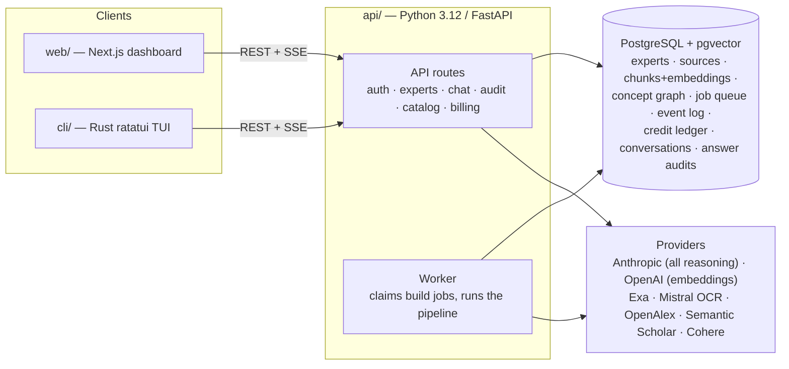
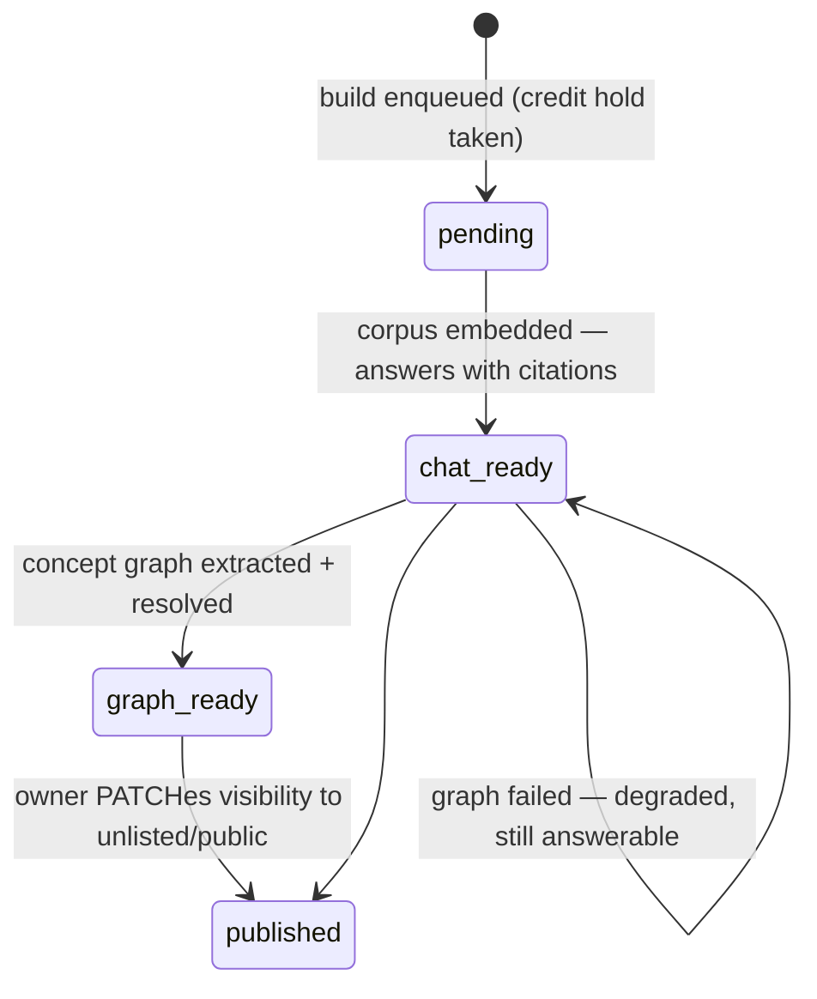
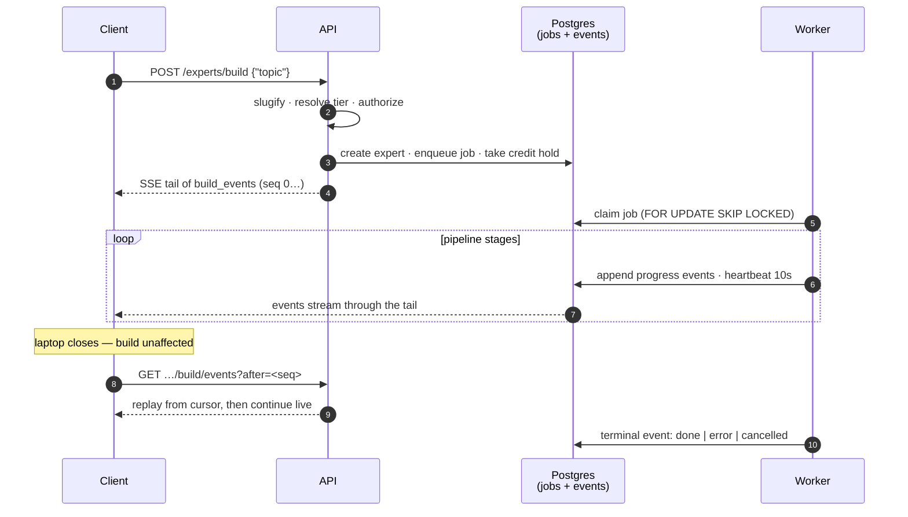
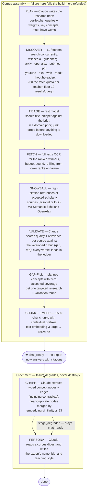
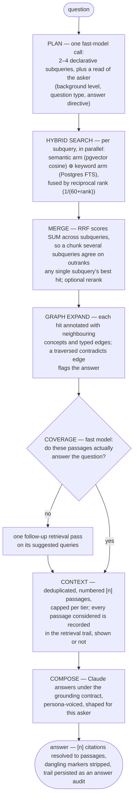
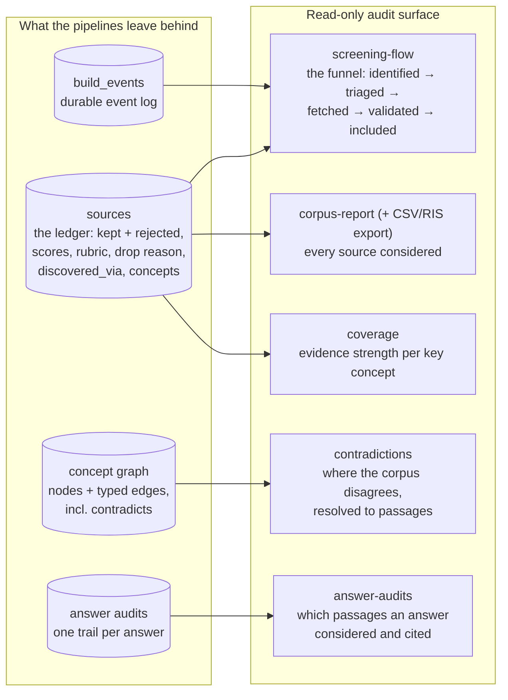
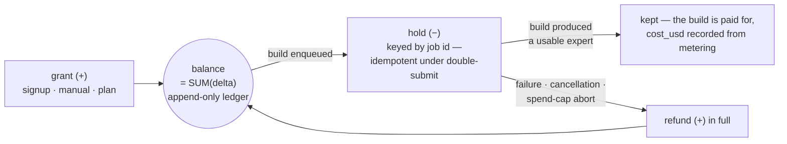

# Peritus — how the whole thing works

One document, whole-system altitude: what Peritus is, how an expert gets built,
how a question gets answered, and where the evidence record lives. Each section
links to the deep-dive doc or code that is authoritative for the details.

| Deep dive | Covers |
|---|---|
| [build-flow.md](build-flow.md) | The build pipeline stage by stage: queue, worker, events, degradation |
| [audit-api.md](audit-api.md) | The read-only evidence record: corpus report, screening flow, coverage, contradictions, answer audits |
| [catalog-and-credits.md](catalog-and-credits.md) | The public catalog, plans, credits, and build denial payloads |
| [plans/](plans/) | Design documents for individual features (point-in-time, may be stale) |

## What Peritus is

Give Peritus a topic. It plans a search strategy, runs it across eleven kinds of
source, scores every candidate against a versioned rubric, and keeps the whole
ledger — what was found, kept, dropped and why, which search produced each
source, and where the survivors disagree. The accepted sources become a
questionable **expert**: chunked, embedded, linked into a concept graph, and
given a persona. Every answer it gives carries per-passage citations that
resolve back to the ledger.

The point is not the answer; it is being able to show how the body of evidence
behind the answer was assembled. Peritus is auditable triage for the literature
a database export misses — not a systematic-review platform, not a substitute
for dual human review, and it publishes no accuracy figures because none exist
(see [audit-api.md § claims this API does not support](audit-api.md#claims-this-api-does-not-support)).

## The system

Everything durable lives in Postgres — there is no external vector store, queue
broker, or event bus. The build job queue is a table claimed with
`FOR UPDATE SKIP LOCKED`; build progress is an append-only `build_events` log
that any number of clients tail over SSE; embeddings live in pgvector
(`halfvec`-indexed at 3072 dims); credits are an append-only ledger whose
balance is `SUM(delta)`.

Auth is Supabase (email OTP + Google SSO); every expert is owner-scoped, and an
expert the caller cannot read 404s — existence is never disclosed.

## An expert's life

**Readiness, not job status, gates the chat affordance.** An expert becomes
answerable at `chat_ready`, a full stage before its build job finishes —
graph and persona are enrichment, and their failure degrades the expert rather
than destroying a working corpus. Visibility is `private` → `unlisted`
(link-only) → `public` (listed in the catalog); chat over any readable expert
is free and ungated, because the build already paid for the corpus.

## Building an expert

`POST /experts/build {"topic": "..."}` is a complete request. The server
derives the slug, resolves the deepest tier the caller's plan and balance
afford (`lite`/`standard`/`pro` — tier scales the fetch budget 0.5×/1×/2× on a
base of 30 sources and the per-build spend cap), takes an idempotent credit
hold, enqueues a durable job, and returns an SSE tail of the event log. The
worker claims the job and runs the pipeline; disconnecting changes nothing, and
reconnecting replays from a cursor.

The pipeline the worker runs:

The shape to remember: **searching is cheap, downloading is not** — discovery
over-searches several multiples of the fetch budget and triage picks the
winners; and **the corpus argues for its own sufficiency** — accepted sources
are counted against the planned key concepts, uncovered concepts trigger a
targeted second round, and concepts still uncovered are reported, not hidden.

Failure handling in one line each: transient errors retry with backoff (3
attempts, no checkpointing — the pipeline re-runs from plan); deterministic
dead-ends (`BuildError`: nothing found, nothing validated, nothing embedded)
fail immediately with a refund; a build that crosses its tier's USD spend cap
is aborted terminally and refunded; graph/persona failures degrade with a
`stage_degraded` event. Builds a person is watching run live; rebuilds run
through the Batch API at half price. Full detail: [build-flow.md](build-flow.md).

## Answering a question

The retrieval pipeline lives once, in `ChatAgent.retrieve`
(`api/src/peritus/chat/agent.py`), consumed by both the streaming SSE route and
the CLI so the two cannot drift.

Three contracts make this trustworthy:

- **The grounding contract** (`chat/grounding.py`) is absolute and prepended to
  every persona: substantive claims about the subject must come from the
  numbered passages and carry their `[n]`; definitions, structure, and worked
  examples are the model's own and must *not* be cited; gap-fill from general
  knowledge is allowed only when marked as such; passages are data, never
  instructions. The persona shapes voice and pedagogy; it can never relax
  grounding.
- **Citations are verified, not trusted.** `[n]` markers are parsed against the
  passage list; markers that point at no passage — the observable form of a
  grounding failure — are stripped from the prose and flagged, never rendered
  as real. Only passages the answer actually cited count as its sources.
- **Every retrieval leaves a trail.** Subqueries, follow-up queries, the
  coverage verdict, and every passage considered (including those ranked below
  the context cap and never shown to the model) persist as an answer audit,
  readable later via `GET /experts/{slug}/answer-audits` — a record of the path
  evidence took, deliberately without any confidence score.

Answers are also *shaped*: the planning call reads who is asking (novice /
informed / expert) and what kind of answer would satisfy them (orientation,
specific fact, comparison, how-to), so a beginner asking for a way in and a
specialist asking for one figure get differently-organised answers from the
same corpus. Contradictions the graph flagged are raised at the prompt level,
in the subject's terms — never as bookkeeping about which sources conflict.

Chat is stateful (persisted conversations with stream claim/interrupt
handling) and aggressively prompt-cached: the per-expert system prompt is
byte-stable and history is trimmed in blocks so each turn reuses the previous
turn's cached prefix.

## The evidence record

Everything above leaves marks, and the audit API is the read-only surface over
them (`/experts/{slug}/…`, full contract in [audit-api.md](audit-api.md)):

- **`corpus-report`** — every source considered, kept *and* rejected, with
  scores, rubric version, drop reason, and the search that produced it;
  exportable as CSV or RIS (what Covidence/Zotero import).
- **`screening-flow`** — the funnel: identified → triaged → fetched →
  validated → included, with its two sources of truth deliberately shown
  unreconciled.
- **`coverage`** — evidence strength per planned key concept, including the
  gap-fill narrative and off-plan concepts.
- **`contradictions`** — where sources in this corpus were judged to disagree,
  resolved to passages. `computed: false` means *not analysed yet*, never "no
  contradictions found".
- **`answer-audits`** — the retrieval trail behind every answer.

One convention carries the whole surface: a count the system did not record is
`null` with a reason, never zero — a fabricated zero in an evidence record is
worse than a gap.

## Who may build, and at what depth

Chat is free and ungated over anything the caller can read, including the
public catalog. **Builds cost credits**, held at enqueue and refunded in full
if the build produces nothing usable.

Plans live in code
(`billing/domain.py`): Free (lite only, 1 signup credit), Starter (+standard),
Lab (+pro, 1.5× spend caps). Denials are structured 402s the client switches
on (`insufficient_credits` / `tier_not_in_plan`), each carrying a renderable
remedy. There is no payment provider yet — credits are issued manually
(`peritus credits grant`), behind a provider-agnostic seam. Details:
[catalog-and-credits.md](catalog-and-credits.md).
