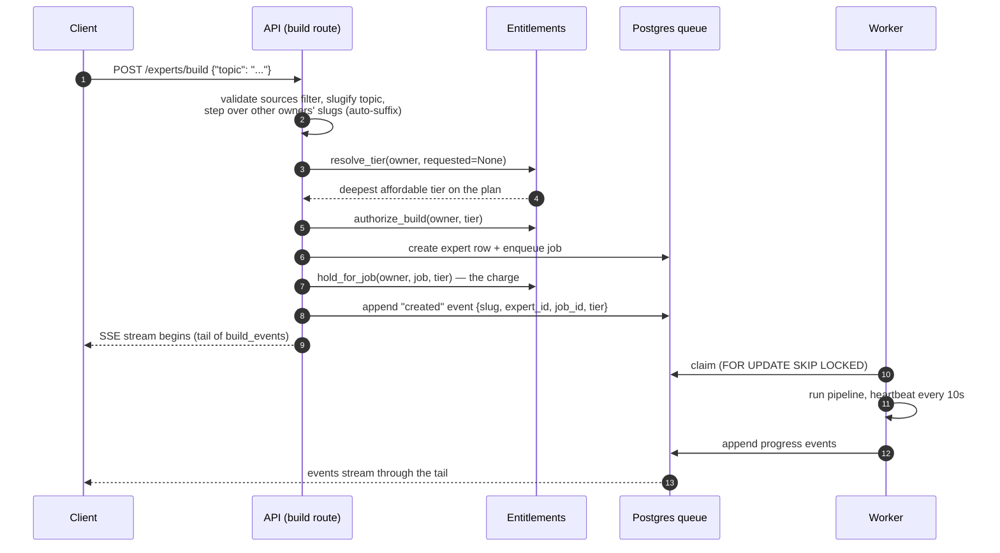
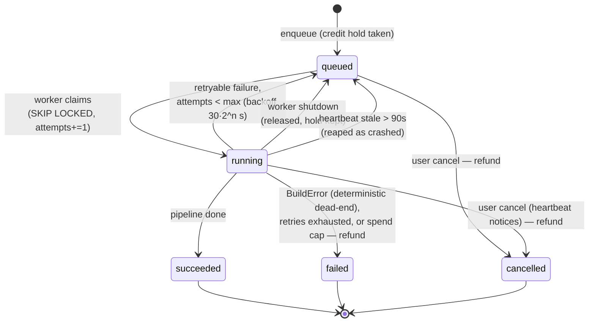
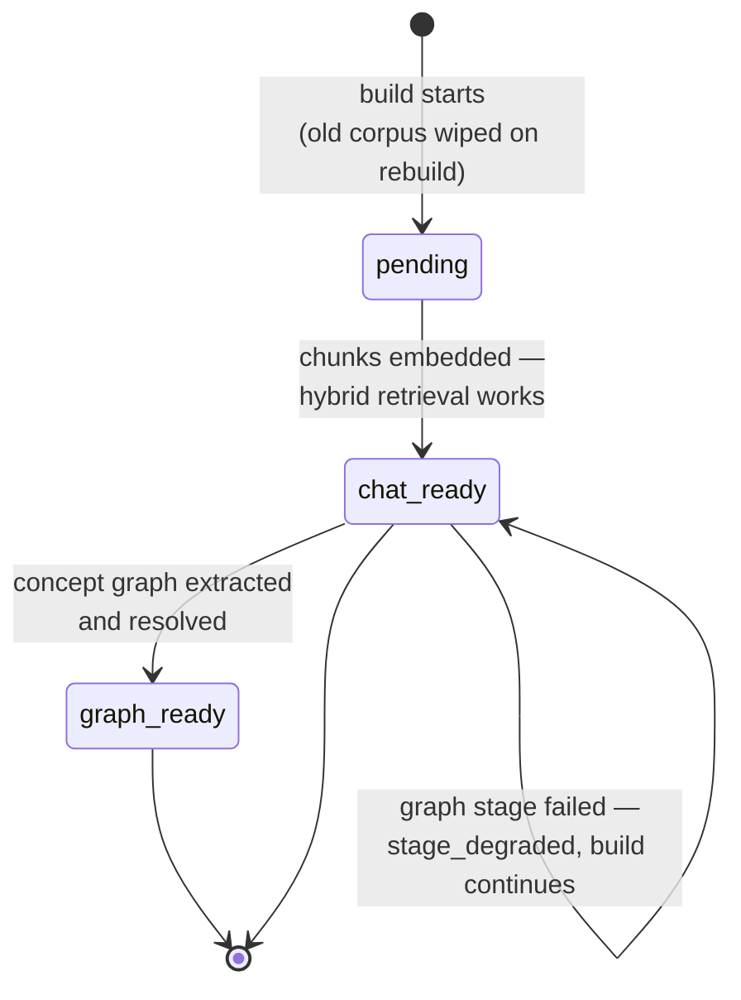

# The build flow: from a topic to a questionable expert

This is the authoritative walkthrough of what happens between a user typing a
topic and an expert answering questions with citations. It covers the HTTP
contract, the durable job queue, every pipeline stage, the readiness model,
and what happens when things fail. File references point at the code that
implements each step.

Related reading: [audit-api.md](audit-api.md) (reading the record back),
[catalog-and-credits.md](catalog-and-credits.md) (who may build, at what depth).

## Design goals

1. **A topic is enough.** `POST /experts/build {"topic": "..."}` is a complete,
   valid request. The server derives the slug, resolves the deepest tier the
   caller's plan and balance support, plans the search strategy, names the
   expert, and writes its persona. Every additional field is an override, not a
   requirement.
2. **Builds are durable.** The build runs in a worker off a Postgres job queue,
   not in the request. Closing the laptop, losing the connection, or restarting
   the server does not kill a build; reconnecting replays progress from a cursor.
3. **Usable before finished.** The expert is published as chat-ready the moment
   its chunks are embedded — a full stage before the build completes. Graph and
   persona are enrichment: if they fail, the build degrades and says so instead
   of failing (and re-running) a corpus that already works.
4. **Everything is on the record.** Every source considered — kept or dropped —
   lands in the `sources` ledger with scores, the rubric version, the drop
   reason, and which search produced it. Every progress event lands in
   `build_events` and can be replayed.

## The cast

| Component | File | Role |
|-----------|------|------|
| Build route | `api/src/peritus/api/routes/experts.py` (`build_expert`) | Validates, resolves slug + tier, charges credits, enqueues, streams |
| Entitlements | `api/src/peritus/billing/service.py` | Plan/credit checks, tier resolution, holds and refunds |
| Job queue | `api/src/peritus/jobs/repository.py` | `build_jobs` + `build_events` tables; claim/heartbeat/retry/reap |
| Worker | `api/src/peritus/jobs/worker.py` | Claims jobs, runs builds with heartbeat + cost meter |
| Builder | `api/src/peritus/experts/builder.py` | The seven-stage pipeline itself |
| Validator | `api/src/peritus/sources/validator.py` | Quality/relevance scoring against the versioned rubric |
| Ingestion | `api/src/peritus/ingestion/pipeline.py` | Chunk → contextualise → embed → store |
| Graph | `api/src/peritus/graph/extractor.py`, `graph/repository.py` | Concept nodes/edges, entity resolution |
| Readiness | `api/src/peritus/search/readiness.py` | `pending → chat_ready → graph_ready` |

## 1. The request

Step by step (`routes/experts.py`, `build_expert`):

1. **Source filter validation.** `sources`, when present, must be a non-empty
   subset of the builder's fetcher names (`FETCHER_NAMES` in `builder.py`);
   anything else is a 400 that lists the valid names. Previously an unknown
   name silently produced an empty discovery round and a dead build.
2. **Slug derivation.** `_slugify(topic)` — lowercase, non-alphanumerics to
   `-`, 80 chars. The slug **is** the expert's name; there is no separate name
   field anywhere in the flow.
3. **Collision handling.** Slugs are globally unique, but topics collide
   legitimately. The route walks `base`, `base-2`, `base-3`… until it finds
   either a slug the caller already owns (their expert on this topic → this is
   a **rebuild**) or a free slug (→ **create**). Another user's expert is
   stepped over silently — its existence is never revealed. Fifty collisions
   deep it gives up with a 409.
4. **Tier resolution.** If the request names a tier, it is honoured and judged
   as-is. If not, `EntitlementService.resolve_tier` picks the deepest tier the
   caller's plan allows *and* their balance can pay for — a fresh free account
   gets `lite`, a funded lab account gets `pro`. When nothing is affordable it
   returns the plan's cheapest tier so the 402 that follows quotes the smallest
   viable purchase. (Before this existed, the fixed `standard` default made a
   bare `{"topic"}` request un-buildable on the free plan.)
5. **Authorisation, then the hold.** `authorize_build` checks plan + balance
   before any row exists; `hold_for_job` takes the actual credit hold after the
   job row exists, idempotently per job id, under a row lock. A double-submit
   that lands on the same job never double-charges. If the hold fails, the job
   is cancelled rather than left to run unpaid.
6. **Rebuilds move tier and config together.** A rebuild that names a new tier
   updates `experts.tier` *and* `experts.config` (`repo.update_tier`) — the
   builder reads its depth budget off `expert.config`, so before this fix a
   "rebuild as pro" silently rebuilt at the old depth.
7. **The `created` event.** The first event appended to the durable log is
   `{"type": "created", "slug", "expert_id", "job_id", "tier", "topic"}` — so
   every client, including one that reconnects later, learns which expert the
   stream belongs to without re-implementing the server's slugify.
8. **The response is the stream.** The route returns an SSE tail of
   `build_events` from seq 0. Disconnecting does not affect the build; a
   `POST` for a topic whose build is already running attaches to the existing
   job (no new charge).

## 2. The queue and the worker

- **Claiming** uses `FOR UPDATE SKIP LOCKED`, so any number of workers can poll
  the same queue without contention; a partial unique index guarantees at most
  one active build per expert (`jobs/repository.py`).
- **Heartbeats** every 10s serve three jobs at once: prove liveness (stale
  jobs are reaped and requeued), notice cooperative cancellation (a heartbeat
  that returns false means the job was cancelled under us), and check the
  spend meter (a build over its USD cap is aborted mid-stage, refunded, and
  never retried).
- **Retries**: an unexpected exception requeues with exponential backoff
  (30s/60s/120s) up to 3 attempts. `BuildError` is the builder saying "running
  this again cannot help" (no sources found, everything failed validation,
  nothing embedded) — those fail immediately and refund.
- **There is no checkpointing.** A retry re-runs the whole pipeline from plan
  onward (`reset_build_state` wipes non-upload sources, chunks, and the graph).
  This is why the enrichment stages degrade instead of raising — see §4.
- **Poll resilience.** The worker's claim loop survives dropped database
  connections (routine under a transaction pooler): failed polls back off
  exponentially, capped at 60s, without killing in-flight builds.
- The worker runs standalone (`peritus-worker`, `Procfile.dev`) or inside the
  API process (`RUN_WORKER_IN_PROCESS=true`) — same loop either way.

## 3. The pipeline

```mermaid
flowchart TD
    T(["topic"]) --> P["0 · PLAN<br/>Claude writes the research brief:<br/>per-fetcher queries + weights, 5–8 key concepts,<br/>what counts as primary here, canonical works,<br/>and a primary text per concept (with sections)"]
    P --> CW["0b · PRIMARY TEXTS<br/>each named work looked for by title, by kind:<br/>texts: Gutenberg → Internet Archive → Exa<br/>papers: arXiv → OpenAlex → Exa · standards: Exa<br/>best hit per work queued first, cut to its sections"]
    CW --> TR
    P --> D["1 · DISCOVER<br/>11 fetchers search concurrently, over-searching<br/>3× the fetch quota (floor 10 results/query):<br/>wikipedia · gutenberg · arxiv · openalex · pubmed<br/>pdf · youtube · exa · web · reddit · thought-leaders"]
    D --> DD["1b · DE-DUPLICATE<br/>identity (shared DOI/arXiv/PMID/PMCID),<br/>then normalised URL, against everything<br/>every earlier round already considered"]
    DD --> TR["1c · TRIAGE<br/>Haiku scores candidates by id on title+snippet<br/>against the brief, + a domain prior;<br/>unscored → re-asked → fails closed at 0"]
    TR --> F["1d · FETCH<br/>score floor (6, relaxable to 5 in round 0);<br/>ordered by triage score, cost breaking ties;<br/>bounded by a source count AND a dollar budget;<br/>every candidate's outcome → screening ledger"]
    F --> CD["1e · FINGERPRINT<br/>simhash over the fetched text catches the<br/>preprint/published pair sharing no id"]
    CD --> V["2 · VALIDATE<br/>Claude scores quality + relevance per source<br/>against versioned rubric, tags covered concepts<br/>(q≥5, r≥6 — below drops, reason recorded);<br/>borderline scores can go to a stronger model"]
    V --> CV["2b · MEASURE COVERAGE<br/>caps: abstract-only ≤15%, tertiary ≤25%;<br/>each key concept vs the tier's target:<br/>min sources · types · non-tertiary · a primary<br/>(abstract-only sources never count)"]
    CV --> LP{"targets met AND the<br/>guaranteed round ran?<br/>rounds, budget,<br/>new candidates left?"}
    LP -- "search again" --> FB["1a′ · FEEDBACK + SNOWBALL<br/>weakest concepts → new queries written from<br/>the corpus's own vocabulary; accepted scholarly<br/>sources followed backwards AND forwards<br/>through their citations, ranked by co-citation"]
    FB --> DD
    LP -- "stop, with a reason" --> CE["3 · CHUNK + EMBED<br/>1500-char chunks, contextual prefixes,<br/>text-embedding-3-large → pgvector"]
    CE --> CR(["★ CHAT-READY<br/>the expert now answers with citations"])
    CR --> GX["4 · GRAPH EXTRACT<br/>Claude reads chunk batches → claims, concepts,<br/>and the about/part_of edges between them"]
    GX --> ER["4b · RESOLVE<br/>merge near-duplicate nodes<br/>by embedding similarity ≥ .93"]
    ER --> RC["4c · RECONCILE<br/>one call per concept over the claims every<br/>source makes about it → supports · contradicts · qualifies"]
    RC --> GR(["★ GRAPH-READY<br/>retrieval now expands hits with<br/>their concepts + what the corpus disputes"])
    GR --> PE["5 · PERSONA<br/>Claude reads a corpus digest + top concepts,<br/>writes name, bio, teaching style"]
    PE --> DONE(["done"])
    GX -. "failure degrades:<br/>stays chat-ready,<br/>stage_degraded event" .-> PE
    PE -. "failure degrades:<br/>nameless expert,<br/>re-voiceable later" .-> DONE
```

Stage notes, in pipeline order (`experts/builder.py`):

- **Plan** is one call on the strong model; the brief shapes everything
  downstream. A failed plan degrades to raw-topic queries with equal weights
  rather than failing the build. **Before it, the planner reads** how one or two
  reference overviews structure the topic (`sources/orientation.py`): the
  Wikipedia article titled after it and an SEP / IEP / Britannica entry, each as
  a lead and a two-level outline, under one 8-second deadline that never fails
  the build. They are a checklist of facets, not the syllabus, and are not added
  to the corpus. The syllabus has **two levels**: 2–5 facets, 2–4 concepts each,
  at most 8 / 10 / 14 concepts by tier (`max_key_concepts`); `key_concepts`
  stays the flat list every reader uses. The plan also names **figures** — the
  people whose own writing is primary — each with one freely obtainable work,
  and marks every named work `public_domain` / `open_text`, naming a
  `substitute` for one that cannot be had. All of it is on
  `experts.research_plan` and `plan_ready` (`facets`, `figures`, `orientation`). The planner may zero out a source type
  (weight 0 = "would add noise here") unless the user's explicit `sources`
  filter requested it. Fetchers are routed by kind: `arxiv` for STEM preprints,
  `pubmed` for biomedical literature, and `openalex` as the scholarly channel
  for *every other* discipline (humanities, social science, law, economics…) —
  the prompt tells the planner to find the adjacent research field before
  zeroing it, on the view that every topic has some scholarly literature.
- **Discovery over-searches** the fetch budget because searching is cheap and
  downloading is not; triage decides what deserves a full fetch. Each fetcher
  requests 3× its fetch quota, spread across its planned queries, with a floor
  of 10 results per query (`_search_breadth`) — the floor exists because on a
  lite build the raw arithmetic gave triage only 1–2 candidates per query,
  leaving it nothing to be selective *with*; search-API calls are free and the
  costly stages (fetch, OCR, validation, chunking) are bounded by the fetch
  budget, not the candidate pool. The fetch budget scales with tier
  (`source_multiplier`: 0.5/1.0/2.0 on a base of 60). Per-type caps stop one
  source type from flooding the corpus: each type may take up to twice its
  *planned share* of the budget, so the caps sum to twice the budget and shape
  the corpus's mix without ever deciding its size. They were a fixed `quota × 2`
  until a live build showed four of six productive types capping out while both
  the count ceiling and the money budget went untouched — a cap that does not
  scale with the budget quietly takes the sizing decision away from it.
- **Triage** combines the model's expected-value score with a **domain prior**
  (`sources/triage.py`): title and snippet alone can't distinguish a work from
  a summary of that work, so known hosts get a nudge — journals and archives up
  (arxiv.org, nature.com, doi.org, europepmc.org…), content farms, library
  catalogue records, tables of contents and overview mills down. Scores are
  matched to candidates **by the id the model echoes**, never by position; a
  candidate left unscored is re-asked in batches of 10 and then 5, and one still
  unscored scores **0 and is not fetched** unless a must-have title or a
  co-citation vouches for it. There is no neutral fallback score: the old 5.0
  outranked every honest 3 and 4 and fetched an actress into a Thomism corpus.
- **The fetch floor.** A candidate under `FETCH_SCORE_FLOOR` (6.0) is not
  fetched however much count and money remain; the count stays a ceiling. If
  fewer than max(8, budget/4) candidates reach it in round 0, round 0 fetches
  down to 5.0 and says so (`floor_relaxed`). Every candidate triage saw is
  written to `candidate_screenings` with its model score, prior, fetch rank and
  outcome (`fetched | failed | capped | below_floor | near_duplicate | budget |
  not_reached | content_duplicate`), and the plan itself to
  `experts.research_plan` (migration 029). `python -m peritus.eval.triage`
  exports a job's ledger for labelling and measures triage against the labels.
- **Canonical works** (`sources/canonical.py`). Each must-have the plan names
  is looked for by title before triage: Project Gutenberg's catalogue, held
  locally and refreshed weekly (`infrastructure/gutenberg_catalogue.py`); the
  Internet Archive's full-text items; Exa restricted to primary-text hosts; Exa
  unrestricted. Each hit is **whole** or **partial** — a title with a question,
  chapter, book, part or volume number is partial, and a title *about* the work
  ("A Companion to…") is not a hit at all — and the search stops at the first
  whole hit. Hits are fetched first; only a *whole* one that passes validation
  makes the work `found_whole` in `build_summary.corpus.must_have`.
- **Primary texts per concept, not only per topic.** The plan says what counts
  as primary for this topic (a thinker's own writings, trial reports, a standard,
  documents from the period) and names, for each key concept, the primary text
  that sets it out — with the numbered sections that do, for a long work. The
  resolver looks each up by the kind of work it is, merges a work named more
  than once, and queues only its best hit ahead of triage (canonical works
  first, then concept texts, within half the round's money). Fetchers cut the
  named sections out of long texts (`sources/sections.py`: `QUESTION 94`,
  `CHAPTER IV`, `Book II, chapters 1–10`, a specification's `9.` or `## 9.2.1.`),
  up to 200k characters for a canonical work and 60k for a concept text on
  STANDARD. The corpus summary reports each as `found_whole`, `found_sections`,
  `found_partial`, `not_found` or `not_obtainable` — an in-copyright work with no
  free text gets one open Exa search, never the public-domain libraries, and its
  `substitute` is then resolved as a work of its own. A figure's work (3 on
  STANDARD, 6 on PRO, `figure_texts`) is resolved after the concept texts, with
  a concept text's ceiling; `build_summary.corpus.figures` says per figure
  whether the corpus holds them in their `own_voice`, `about_only`, or
  `not_found` / `not_obtainable`. When a round still finds a concept without a
  primary source, the strong model is asked which primary text sets it out, and
  those titles are resolved the same way — search queries alone return
  scholarship *about* a subject. The validator is shown the plan's definition of
  primary (rubric `v8-graded-tags-q5r6`).
- **Resolver volumes are not near-duplicates.** Triage's title near-duplicate
  filter compares a must-have candidate only with candidates for the same work
  and sections, and never across volume designators ("Part I-II" vs "Part I"),
  so the resolver's per-volume lookups survive. The must-have boost is not
  given to a work already found whole, nor to a title about the work (an
  encyclopedia or summary-service suffix or host, or the work named after
  "in" / "of" / "on"). Every fetch is cut to its stamped `text_max_chars` where
  it arrives (`ceiling_enforced` in the log).
- **What is not used.** Internet Archive items are used only when their metadata
  shows a public-domain or open licence or a publication year before the US
  cutoff (95 years back); any archive.org page, however it was found, goes
  through that check and to the item's text rather than its catalogue page.
  Pirate PDF mirrors are penalised at triage and excluded from Exa. A fetched
  text not in `CORPUS_LANGUAGE` (English by default) is dropped before
  validation (`not_english` in the ledger).
- **Channels report why they are empty.** `fetcher_done` carries `status`
  (`ok | empty | timeout | rate_limited | error | skipped`) and the error. A
  timed-out or rate-limited channel is retried once in the same round, and any
  channel whose last search failed joins later rounds. Gutenberg resolves books
  through its catalogue and uses Gutendex only as a fallback, with a 10-second
  per-call timeout that keeps the books already resolved. Exa excludes the hosts
  the triage prior penalises hardest; OpenAlex puts works with a route to full
  text ahead of abstract-only records; Reddit's base quota is 2.
- **De-duplication** runs three passes with different amounts of evidence
  (`sources/dedup.py`). *Identity* is certain and runs before triage: two
  candidates sharing a DOI, arXiv id, PMID or PMCID are one work, and the copy
  whose fetcher yields the best full text survives carrying the others'
  identifiers and provenance. *URL* follows, on a normalised form that strips
  tracking parameters and maps `arxiv.org/abs/…`, `arxiv.org/pdf/…` and ar5iv
  to one key. *Content* runs after fetching, as a simhash over word 5-shingles
  — this is the preprint-versus-published-version case, where the two records
  share no identifier at all. Its Hamming threshold (10 of 64 bits) is
  calibrated against the real corpus rather than taken from the textbook: at the
  conventional 3 it catches 9.3% of true duplicates and can only see documents
  differing by whitespace, which the first two passes already catch. 10 is the
  largest distance with no observed false merge over 780 distinct pairs, chosen
  that way because the errors are asymmetric — a missed duplicate costs money
  and shows in the ledger, a false merge silently deletes a good source. About
  40% of real near-duplicates still get through. Embeddings are deliberately not
  used: they cost money and the chunk embeddings do not exist yet at this point.
- **Full text** is resolved by one chain for every scholarly path
  (`sources/fulltext.py`), ordered by quality first and cost second: ar5iv HTML
  → Europe PMC JATS → OCR of an open-access PDF → the OA landing page →
  title + abstract. The order is what makes it worth having: a biomedical paper
  found through OpenAlex now gets Europe PMC's free structured full text rather
  than a per-page OCR bill for the publisher's PDF, and an arXiv paper whose
  ar5iv render fails falls back to the PDF instead of all the way to its
  abstract. Which step ran is recorded on `sources.full_text_method`.
- **Snowball** follows the citations of accepted scholarly sources through
  Semantic Scholar, *both ways* (`sources/snowball.py`). Backward citation
  finds a seed's ancestors; forward citation finds the work that superseded it,
  which the planner cannot know about because it postdates whatever made the
  topic famous. Candidates are ranked by **co-citation** — how many different
  accepted sources point at the same work — then by percentile within the
  seed's own reference list. The percentile replaces the old flat 50-citation
  floor, which was really a filter on discipline: 50 citations means canonical
  in a small humanities subfield and unremarkable in machine learning. Results
  enter the round's triage like any other candidate rather than bypassing it,
  which is also the only way to compare their acceptance rate against the plan
  fetchers'. Per-round caps: lite 3, standard 10, pro 20.
- **Validation** shows the model a *record*, not an excerpt
  (`sources/preview.py`): the facts the pipeline already knows stated as facts
  (length, how the text was obtained, whether a reference list was detected,
  how the source was found, citation count, year, venue), the abstract, up to
  twelve section headings, and body samples drawn from outside the front matter
  and the bibliography. The old preview was three fixed 800-character windows,
  which asked the model to infer all of that from prose. The rubric version
  (`v6-substance-q5r6`) names catalogue records, tables of contents and
  publisher blurbs as tertiary with quality at most 3, and study guides as
  tertiary scored on depth rather than title match.
- **Substance and composition** (`sources/substance.py`,
  `experts/composition.py`). Every source is `full`, `partial` (a landing page
  or a text cut at the length cap) or `abstract` (only an abstract, or under
  1,500 characters). An abstract-only source must rest on ≥ 800 characters of
  abstract, is capped at 15% of a round's accepted sources, and **never counts
  toward coverage**. Tertiary sources are capped at 25%. What a cap removes is
  dropped with a reason and kept as `passed = false`. `build_summary.corpus`
  reports the tier and abstract-only shares, junk fetched (fetched sources
  scored ≤ 3 for relevance), each concept's share and the concepts with no
  primary source; the audit report shows it under `selection`.
- **Depth targets and the guaranteed round.** STANDARD wants 3 counting
  sources, 2 types, a non-tertiary *and a primary* source per concept, and PRO
  4; both always run at least one feedback round, and round 0 may commit only
  65% of the discovery budget so that round can afford to run. When every
  target is already met, the guaranteed round searches the concepts with no
  primary source first, and the feedback prompt names them. LITE is unchanged.
- **Tags cost something.** Each concept tag has a depth — `sets_out` (the
  source's subject or a chapter of it), `treats`, `mentions` — stored on
  `sources.concept_depths` (migration 030); `covered_concepts` is the tags at
  `treats` or deeper. Coverage counts at most three tags per source, deepest
  first, never a mention, and a work cut to named sections counts only for the
  concepts it was cut for. **The named text gates "has primary":** a concept
  whose plan named a primary text has one when that text is in the corpus
  (whole, cut to its sections, or in part); when it is missing, only a primary
  source that *sets the concept out* stands in for it. A concept with no named
  text keeps the old rule. `coverage_report.concepts[]` carries `named_text` and
  `depth_counts`, and `build_summary.corpus.concepts_missing_named_text` names
  what is absent.
- **Per-source-type hints** still apply: academic types (arxiv, pubmed,
  openalex) are judged on methodology and evidence — an abstract-only record
  can still pass if the abstract substantively states the finding — while
  classic texts are judged on relevance and significance rather than modern
  academic style.
- **A second opinion at the margin.** Sources scoring inside the borderline band
  (4.0 ≤ q < 6.0, or 5.0 ≤ r < 7.0) are re-judged one at a time on the strong
  model with a much larger preview, and that verdict stands. The tails are cheap
  and right; the errors live at the line. Both verdicts are kept —
  `validator_model` is whose verdict stands, `review_model` says a reviewer was
  involved, and `first_pass_quality` / `first_pass_relevance` say what changed.
  Off by default (`VALIDATE_SECOND_OPINION`) until it has been measured against
  a human-labelled set; see `eval/golden/screening/README.md`.
- **An errored validation batch fails open.** It used to drop all five of its
  sources as `validation error` — a fifth of a lite corpus lost to one bad
  response. Those sources now go through the single-source path instead, and
  drop only if that fails too.
- The same pass **writes the ledger**: every source, kept or dropped, with
  `quality_score`, `relevance_score`, `drop_reason`, `validator_model`,
  `review_model` and the first-pass scores where a reviewer was involved,
  `rubric_version`, `doi` / `arxiv_id` / `identifiers`, `full_text_method` and
  `text_chars`, `discovered_via` (`plan` / `snowball:backward` /
  `snowball:forward` / `gapfill:<concept>` / `upload`), `snowball_seed_urls`,
  and `covered_concepts`.
- **Coverage is a target, not a boolean** (`experts/coverage.py`). A concept is
  covered when it has enough accepted sources, from enough different kinds of
  source, including at least one that is not a summary:

  | Tier | min sources | min source types | needs a non-tertiary source | rounds after the first |
  |---|---|---|---|---|
  | LITE | 1 | 1 | no | 1 |
  | STANDARD | 2 | 2 | yes | 2 |
  | PRO | 3 | 2 | yes | 3 |

  LITE's row is deliberately the old behaviour exactly, so its cost profile
  does not move.
- **The loop** re-searches while any concept is short of target. Later rounds
  use only the query-driven fetchers (`exa`, `web`, `wikipedia`, `arxiv`,
  `pdf`, `pubmed`, `openalex`) — the identify-then-fetch fetchers answer a
  broad "who matters here" question that a narrow concept query cannot ask, and
  the noisy ones get worse the narrower the query. The queries themselves come
  from **pseudo-relevance feedback** (`experts/feedback.py`): one fast-model
  call reads the accepted corpus and writes queries in the field's own
  vocabulary, which is the cheapest large gain here — the planner's blind
  queries are the main reason a niche concept comes back empty. A round takes
  its concepts **a facet at a time** — each facet's largest shortfall in turn —
  so one heavy facet's neighbours cannot take the whole round; the prompt groups
  them under their facets and names each missing named text and each figure
  with no work in their own voice. Authors the corpus cites and lacks go to the
  thought-leader search, which looks for the plan's figures in their own voice:
  each person searched with the encyclopedias and summary services excluded and
  on personal sites, and pages about a person dropped before triage. The brief
  is never rewritten between rounds; a loop that can redefine its own goal can
  always declare itself finished.
- **Stopping**, with the reason recorded in `experts.build_summary` and emitted
  as `discovery_done`:

  | Reason | Meaning |
  |---|---|
  | `targets_met` | every concept reached its target — the search finished |
  | `max_rounds` | the tier's round limit, with concepts still short |
  | `budget_exhausted` | the estimated ingest cost of what was found reached the tier's discovery budget |
  | `source_limit` | the tier's ceiling on how many sources one build may fetch was reached — a count, not a cost, so the money may still be unspent |
  | `no_new_candidates` | a round's searches returned nothing not already considered |
  | `acceptance_collapsed` | a round fetched real sources and validation wanted almost none of them — the search space is exhausted, not under-explored |
  | `loop_disabled` | a single pass; the loop is off for batched background builds, where each round queues its own Message Batch |
- **Budget.** Discovery is bounded twice, and the two limits report separately
  because they mean different things. The count budget (60 × tier multiplier, so
  30 / 60 / 120) is a ceiling that should rarely bind — it was 60 in total until
  a live PRO build filled it in round 0 and left round 1 able to add four
  sources with $4.71 of its $7.00 still unspent. The real limit is an *estimate*
  of what the sources fetched so far will cost to ingest
  (`billing.pricing.estimated_ingest_cost_usd`), measured against the tier's
  `discovery_budget_usd` (lite $1.25 · standard $3.00 · pro $7.00 — all well
  under the hard spend caps, which the worker still enforces separately). Cost
  scales with characters, not with source count: a 120,000-character monograph
  and a 2,000-character blog post are one unit each to a count and two orders
  of magnitude apart in what they cost. The fetch queue is ordered by **triage score, with cost
  as the tiebreaker** — not by value per dollar, which the plan asked for and
  which is wrong: cost scales with length, the longest texts are the primary
  sources, and a live "Thomism" build ordered that way produced 48 sources
  containing no work by Aquinas, 17 tertiary to 2 primary, with a Reddit thread
  scoring 4 outranking the Summa Theologica scoring 9. Ordering by score keeps
  what cost-awareness was actually for — between two equally-rated papers the
  one with free full text is fetched first and OCR is paid last. A front rank is
  reserved for candidates with independent evidence behind them: a work the plan
  named as canonical, or one two or more accepted sources both cite. After each round's validation the budget reserved
  for rejected sources is released: the estimate has to be made at fetch time,
  before anything is judged, but only accepted sources are ever ingested. The estimator's constants are
  **not yet calibrated against real builds**: `GET /experts/{slug}/build/usage`
  returns the forecast and the metered cost side by side so the error is
  visible.
- **Chunk + embed** runs all sources' contextualisation as one batch (half
  price when the Batch API path is on). The moment chunks are stored, counts
  are written and the expert flips to **chat-ready** — retrieval needs chunks,
  not the graph.
- **Graph + persona are best-effort** (see §4).
- On a rebuild, user-uploaded sources survive the reset and are fed back into
  the graph stage; the final counts include them.

### Execution policy: live vs batched

A build declares once, up front, whether its Claude calls run live (fast, full
price) or through the Message Batches API (half price, up to ~1h queueing per
stage). `BUILD_EXECUTION_DEFAULT=auto` reads it off the expert: a first build
(no persona yet — nobody has ever seen this expert finish) runs live because a
person is watching; rebuilds and refreshes batch. `interactive` / `background`
force one mode deployment-wide; `ANTHROPIC_BATCH_ENABLED=false` is the kill
switch above all of it. (`infrastructure/anthropic_batch.py`)

## 4. Readiness and degradation

`readiness` is a separate axis from job status, and clients should gate the
chat affordance on it — `status` reaches `ready` only when the whole job
finishes, one-plus stages after the expert became answerable. The catalog
lists on readiness for the same reason.

**The degradation contract.** Everything up to chat-ready is load-bearing: a
failure there fails the build (and retries if it might be transient). Everything
after chat-ready is enrichment, and the builder refuses to let enrichment
failures destroy a working corpus:

| Stage fails | What happens | Event | Recovery |
|-------------|--------------|-------|----------|
| Plan | Degrades to raw-topic queries, weight 1 everywhere | (logged) | none needed |
| A fetcher | That fetcher contributes nothing; others proceed | `fetcher_done {skipped, reason}` | a later round may compensate |
| Feedback queries | The round falls back to `topic + concept` queries | (logged) | none needed — costs query quality, never a round |
| Snowball (Semantic Scholar) | That round contributes no citation candidates | (logged) | none needed |
| Discovery finds nothing | `BuildError` — terminal, refunded | `error` | fix keys/topic, rebuild |
| All sources fail validation | `BuildError` — terminal, refunded | `error` | different topic/sources |
| Nothing embeds | `BuildError` — terminal, refunded | `error` | rebuild |
| Graph extraction / resolution | Build continues; expert stays **chat-ready**, no graph expansion | `stage_degraded {stage: "graph"}` | rebuild |
| Persona | Build continues; expert answers without a named voice | `stage_degraded {stage: "persona"}` | `ExpertService.regenerate_persona` — one model call, no rebuild |
| Picture | Build continues untouched; the expert shows its monogram | `picture_skipped {reason}` | `ExpertService.refresh_picture` — five HTTP requests, no model call, no rebuild |
| Spend cap crossed | Aborted mid-stage, **not retried**, refunded in full | `error {code: spend_cap_exceeded}` | evidence kept in `build_usage_events` |

Provider dependence, for operators:

| Provider | Required? | Missing/failing means |
|----------|-----------|----------------------|
| Anthropic | boot-required | plan degrades; unscored candidates are re-asked, then not fetched (must-haves still are); validation failure = terminal; graph/persona degrade |
| OpenAI (embeddings) | boot-required | nothing embeds → terminal; graph-node embeddings degrade silently |
| Exa | optional | exa/youtube/thought-leaders fetchers skip, reason surfaced in events |
| OpenAlex | optional, keyless | openalex fetcher and DOI snowball resolution skip. Set `OPENALEX_MAILTO` to join its faster "polite pool" — no key exists |
| Mistral OCR | optional | pdf fetcher skips; PDF uploads rejected |
| Semantic Scholar | optional, keyless | pdf fetcher and snowballing return nothing and report `rate_limited`. Set `S2_API_KEY` to leave the shared unauthenticated pool |
| Project Gutenberg / Internet Archive | optional, keyless | canonical works fall through to Exa; Gutenberg falls back to Gutendex. The catalogue CSV is cached under `GUTENBERG_CATALOGUE_DIR` |
| Cohere | optional | chat rerank falls back to windowed LLM rerank (chat path only) |
| Wikimedia | optional, keyless | the expert gets no picture and shows its monogram; nothing else changes. Set `PERITUS_CONTACT` — their API policy asks for a contact address in the User-Agent |

## 5. Watching a build

Progress is a durable event log, not a live socket. The builder emits events →
the worker appends them to `build_events` with a monotone `seq` → any number of
clients tail the log:

- `POST /experts/build` — the tail starts at seq 0 (fresh or attached).
- `GET /experts/{slug}/build/events?after=<seq>` — reconnect from a cursor.
- `GET /experts/{slug}/build/status` — point-in-time polling.
- `GET /experts/{slug}/build/usage` — what the build actually spent, by stage.

Event vocabulary (payload always carries `type`):

`created`, `build_started`, `execution_mode`, `stage`, `plan_ready`,
`picture_ready`, `picture_skipped`,
`discovery_started`, `round_started`, `feedback_queries`, `dedup_done`,
`canonical_resolved`, `primary_texts_suggested`, `fetcher_done`, `fetcher_retried`, `triage_done`,
`floor_relaxed`, `fetch_progress`, `fetch_done`, `composition_capped`,
`snowball_done`, `source_validated`, `source_reviewed`, `validate_done`,
`coverage_report`, `discovery_done`, `corpus_warning`, `source_ingested`,
`chat_ready`,
`graph_batch_done`, `resolve_progress`, `entities_resolved`, `graph_ready`,
`stage_degraded`, `persona_ready`, `retry`, and the terminals
`done` | `error` | `cancelled`.

`coverage_gaps` and `gapfill_done` were emitted by the single gap-fill round the
discovery loop replaced. Builds from before it still have them in their logs and
the audit surface still reads them, so clients should keep handling them.

Every per-round event carries a `round` field, and events from before the loop
carry none — clients default a missing `round` to 0. Totals across rounds must be
**summed**, not replaced: a three-round build whose client reads only the last
`validate_done` reports one round's corpus as the whole of it.

**`picture_ready` and `picture_skipped` are not stage events.** Finding the
expert's picture starts as a background task the moment `plan_ready` fires, runs
beside discovery under its own deadline, and is awaited only just before the
persona stage — so the event is in the log before `done` for a client replaying
from seq 0, but the search never delays or fails a build. It writes to
`expert_pictures`, never to `experts.avatar`, so it cannot overwrite an identity
the owner chose. `picture_skipped` carries `reason`: `no_candidate` |
`provider_unavailable` | `timeout` | `too_large` | `disabled`.

A client that doesn't recognise an event type should ignore it, not fail —
the vocabulary grows.

## 6. What a topic-only request produces

For `{"topic": "spaced repetition and memory retention"}` on a fresh free
account, the server decides all of this by itself:

| Decision | How |
|----------|-----|
| Slug/name | `spaced-repetition-and-memory-retention` (auto-suffixed on collision) |
| Tier | `lite` — deepest the free plan + 1 signup credit affords |
| Search strategy | Planned per-fetcher queries + weights from the topic |
| Syllabus | 5–8 key concepts the corpus must cover, re-searched until each meets its tier's target or the search stops for a stated reason |
| Corpus | ~15 sources triaged out of a several-× candidate pool, scored, ledgered |
| Persona | Named, with bio and teaching style, from the corpus digest |
| Visibility | `private` (publish later via `PATCH /experts/{slug}/catalog`) |

## 7. The chat loop (context)

Covered in depth elsewhere, but for the shape of the whole system: each
question is planned into subqueries; each subquery runs hybrid search
(pgvector semantic + Postgres full-text, fused by reciprocal rank); hits are
optionally reranked and expanded through the concept graph; a coverage check
may trigger one more retrieval round; then composition happens under a strict
grounding contract — answer only from the numbered passages, cite every claim.
Citations resolve down to the passages actually cited, and dangling `[n]`
markers are flagged, not rendered as real. (`chat/agent.py`, `chat/grounding.py`)
