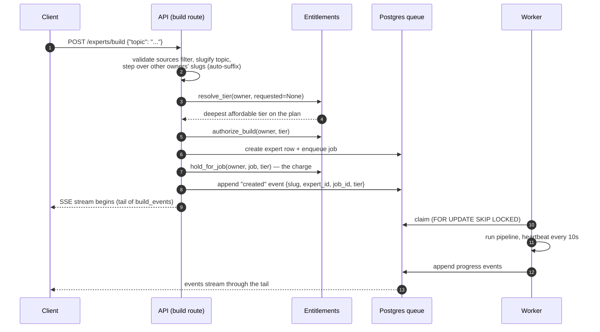
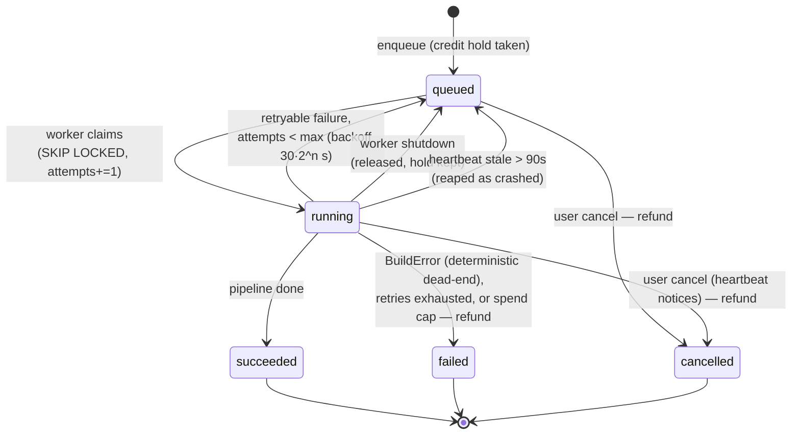
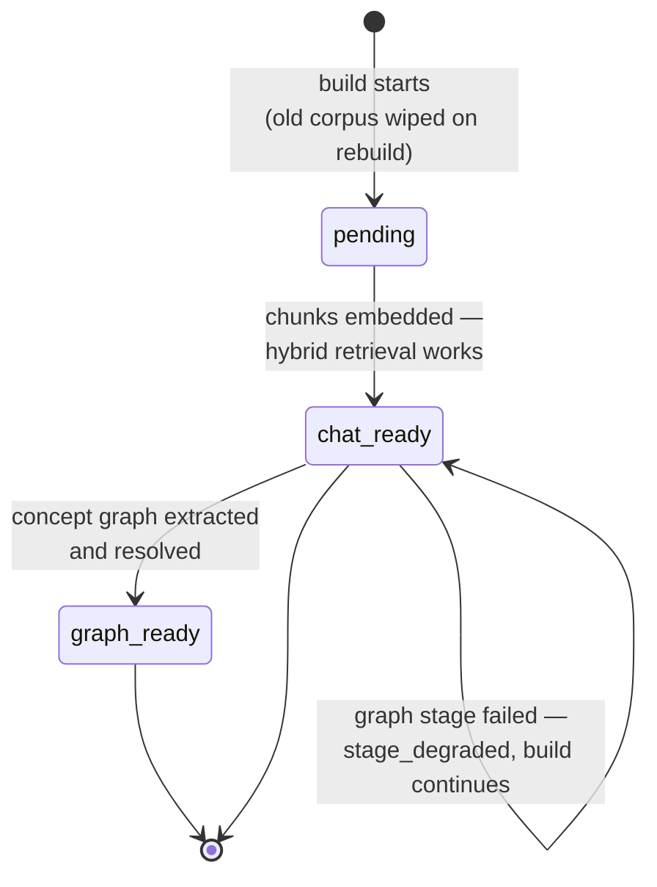

# The build flow: from a topic to a questionable expert

This is the authoritative walkthrough of what happens between a user typing a
topic and an expert answering questions with citations. It covers the HTTP
contract, the durable job queue, every pipeline stage, the readiness model,
and what happens when things fail. File references point at the code that
implements each step.

Related reading: [audit-api.md](audit-api.md) (reading the record back),
[catalog-and-credits.md](catalog-and-credits.md) (who may build, at what depth).

## Design goals

1. **A topic is enough.** `POST /experts/build {"topic": "..."}` is a complete,
   valid request. The server derives the slug, resolves the deepest tier the
   caller's plan and balance support, plans the search strategy, names the
   expert, and writes its persona. Every additional field is an override, not a
   requirement.
2. **Builds are durable.** The build runs in a worker off a Postgres job queue,
   not in the request. Closing the laptop, losing the connection, or restarting
   the server does not kill a build; reconnecting replays progress from a cursor.
3. **Usable before finished.** The expert is published as chat-ready the moment
   its chunks are embedded — a full stage before the build completes. Graph and
   persona are enrichment: if they fail, the build degrades and says so instead
   of failing (and re-running) a corpus that already works.
4. **Everything is on the record.** Every source considered — kept or dropped —
   lands in the `sources` ledger with scores, the rubric version, the drop
   reason, and which search produced it. Every progress event lands in
   `build_events` and can be replayed.

## The cast

| Component | File | Role |
|-----------|------|------|
| Build route | `api/src/peritus/api/routes/experts.py` (`build_expert`) | Validates, resolves slug + tier, charges credits, enqueues, streams |
| Entitlements | `api/src/peritus/billing/service.py` | Plan/credit checks, tier resolution, holds and refunds |
| Job queue | `api/src/peritus/jobs/repository.py` | `build_jobs` + `build_events` tables; claim/heartbeat/retry/reap |
| Worker | `api/src/peritus/jobs/worker.py` | Claims jobs, runs builds with heartbeat + cost meter |
| Builder | `api/src/peritus/experts/builder.py` | The seven-stage pipeline itself |
| Validator | `api/src/peritus/sources/validator.py` | Quality/relevance scoring against the versioned rubric |
| Ingestion | `api/src/peritus/ingestion/pipeline.py` | Chunk → contextualise → embed → store |
| Graph | `api/src/peritus/graph/extractor.py`, `graph/repository.py` | Concept nodes/edges, entity resolution |
| Readiness | `api/src/peritus/search/readiness.py` | `pending → chat_ready → graph_ready` |

## 1. The request

Step by step (`routes/experts.py`, `build_expert`):

1. **Source filter validation.** `sources`, when present, must be a non-empty
   subset of the builder's fetcher names (`FETCHER_NAMES` in `builder.py`);
   anything else is a 400 that lists the valid names. Previously an unknown
   name silently produced an empty discovery round and a dead build.
2. **Slug derivation.** `_slugify(topic)` — lowercase, non-alphanumerics to
   `-`, 80 chars. The slug **is** the expert's name; there is no separate name
   field anywhere in the flow.
3. **Collision handling.** Slugs are globally unique, but topics collide
   legitimately. The route walks `base`, `base-2`, `base-3`… until it finds
   either a slug the caller already owns (their expert on this topic → this is
   a **rebuild**) or a free slug (→ **create**). Another user's expert is
   stepped over silently — its existence is never revealed. Fifty collisions
   deep it gives up with a 409.
4. **Tier resolution.** If the request names a tier, it is honoured and judged
   as-is. If not, `EntitlementService.resolve_tier` picks the deepest tier the
   caller's plan allows *and* their balance can pay for — a fresh free account
   gets `lite`, a funded lab account gets `pro`. When nothing is affordable it
   returns the plan's cheapest tier so the 402 that follows quotes the smallest
   viable purchase. (Before this existed, the fixed `standard` default made a
   bare `{"topic"}` request un-buildable on the free plan.)
5. **Authorisation, then the hold.** `authorize_build` checks plan + balance
   before any row exists; `hold_for_job` takes the actual credit hold after the
   job row exists, idempotently per job id, under a row lock. A double-submit
   that lands on the same job never double-charges. If the hold fails, the job
   is cancelled rather than left to run unpaid.
6. **Rebuilds move tier and config together.** A rebuild that names a new tier
   updates `experts.tier` *and* `experts.config` (`repo.update_tier`) — the
   builder reads its depth budget off `expert.config`, so before this fix a
   "rebuild as pro" silently rebuilt at the old depth.
7. **The `created` event.** The first event appended to the durable log is
   `{"type": "created", "slug", "expert_id", "job_id", "tier", "topic"}` — so
   every client, including one that reconnects later, learns which expert the
   stream belongs to without re-implementing the server's slugify.
8. **The response is the stream.** The route returns an SSE tail of
   `build_events` from seq 0. Disconnecting does not affect the build; a
   `POST` for a topic whose build is already running attaches to the existing
   job (no new charge).

## 2. The queue and the worker

- **Claiming** uses `FOR UPDATE SKIP LOCKED`, so any number of workers can poll
  the same queue without contention; a partial unique index guarantees at most
  one active build per expert (`jobs/repository.py`).
- **Heartbeats** every 10s serve three jobs at once: prove liveness (stale
  jobs are reaped and requeued), notice cooperative cancellation (a heartbeat
  that returns false means the job was cancelled under us), and check the
  spend meter (a build over its USD cap is aborted mid-stage, refunded, and
  never retried).
- **Retries**: an unexpected exception requeues with exponential backoff
  (30s/60s/120s) up to 3 attempts. `BuildError` is the builder saying "running
  this again cannot help" (no sources found, everything failed validation,
  nothing embedded) — those fail immediately and refund.
- **There is no checkpointing.** A retry re-runs the whole pipeline from plan
  onward (`reset_build_state` wipes non-upload sources, chunks, and the graph).
  This is why the enrichment stages degrade instead of raising — see §4.
- **Poll resilience.** The worker's claim loop survives dropped database
  connections (routine under a transaction pooler): failed polls back off
  exponentially, capped at 60s, without killing in-flight builds.
- The worker runs standalone (`peritus-worker`, `Procfile.dev`) or inside the
  API process (`RUN_WORKER_IN_PROCESS=true`) — same loop either way.

## 3. The pipeline

```mermaid
flowchart TD
    T(["topic"]) --> P["0 · PLAN<br/>Claude writes the research brief:<br/>per-fetcher queries + weights,<br/>5–8 key concepts, must-have works"]
    P --> D["1 · DISCOVER<br/>10 fetchers search concurrently at 3× budget:<br/>wikipedia · gutenberg · arxiv · pdf · youtube<br/>exa · web · reddit · thought-leaders · pubmed"]
    D --> TR["1b · TRIAGE<br/>Haiku ranks candidates on title+snippet<br/>against the brief; junk drops before download"]
    TR --> F["1c · FETCH<br/>full content for winners, budget-bound,<br/>refilling from lower ranks on failure"]
    F --> SB["1d · SNOWBALL<br/>high-citation references of accepted<br/>arXiv papers via Semantic Scholar"]
    SB --> V["2 · VALIDATE<br/>Claude scores quality + relevance per source<br/>against versioned rubric, tags covered concepts<br/>(q≥5, r≥6 — below drops, reason recorded)"]
    V --> G["2b · GAP-FILL<br/>key concepts with zero coverage get one<br/>targeted re-search + validation round"]
    G --> CE["3 · CHUNK + EMBED<br/>1500-char chunks, contextual prefixes,<br/>text-embedding-3-large → pgvector"]
    CE --> CR(["★ CHAT-READY<br/>the expert now answers with citations"])
    CR --> GX["4 · GRAPH EXTRACT<br/>Claude reads chunk batches → typed concept<br/>nodes + edges (incl. contradicts)"]
    GX --> ER["4b · RESOLVE<br/>merge near-duplicate nodes<br/>by embedding similarity ≥ .93"]
    ER --> GR(["★ GRAPH-READY<br/>retrieval now expands hits with<br/>neighbouring concepts + contradictions"])
    GR --> PE["5 · PERSONA<br/>Claude reads a corpus digest + top concepts,<br/>writes name, bio, teaching style"]
    PE --> DONE(["done"])
    GX -. "failure degrades:<br/>stays chat-ready,<br/>stage_degraded event" .-> PE
    PE -. "failure degrades:<br/>nameless expert,<br/>re-voiceable later" .-> DONE
```

Stage notes, in pipeline order (`experts/builder.py`):

- **Plan** is one call on the strong model; the brief shapes everything
  downstream. A failed plan degrades to raw-topic queries with equal weights
  rather than failing the build. The planner may zero out a source type
  (weight 0 = "would add noise here") unless the user's explicit `sources`
  filter requested it.
- **Discovery over-searches ~3×** the fetch budget because searching is cheap
  and downloading is not; triage decides what deserves a full fetch. The fetch
  budget scales with tier (`source_multiplier`: 0.5/1.0/2.0 on a base of 30).
  Per-type caps stop one source type from flooding the corpus.
- **Validation** writes the ledger: every source, kept or dropped, with
  `quality_score`, `relevance_score`, `drop_reason`, `validator_model`,
  `rubric_version`, `discovered_via` (`plan` / `snowball` /
  `gapfill:<concept>` / `upload`), and `covered_concepts`.
- **Gap-fill** counts accepted sources against the planned key concepts and
  re-searches any concept with zero coverage — so the corpus carries an
  argument for its own sufficiency. Concepts still uncovered after the second
  round are reported, not hidden.
- **Chunk + embed** runs all sources' contextualisation as one batch (half
  price when the Batch API path is on). The moment chunks are stored, counts
  are written and the expert flips to **chat-ready** — retrieval needs chunks,
  not the graph.
- **Graph + persona are best-effort** (see §4).
- On a rebuild, user-uploaded sources survive the reset and are fed back into
  the graph stage; the final counts include them.

### Execution policy: live vs batched

A build declares once, up front, whether its Claude calls run live (fast, full
price) or through the Message Batches API (half price, up to ~1h queueing per
stage). `BUILD_EXECUTION_DEFAULT=auto` reads it off the expert: a first build
(no persona yet — nobody has ever seen this expert finish) runs live because a
person is watching; rebuilds and refreshes batch. `interactive` / `background`
force one mode deployment-wide; `ANTHROPIC_BATCH_ENABLED=false` is the kill
switch above all of it. (`infrastructure/anthropic_batch.py`)

## 4. Readiness and degradation

`readiness` is a separate axis from job status, and clients should gate the
chat affordance on it — `status` reaches `ready` only when the whole job
finishes, one-plus stages after the expert became answerable. The catalog
lists on readiness for the same reason.

**The degradation contract.** Everything up to chat-ready is load-bearing: a
failure there fails the build (and retries if it might be transient). Everything
after chat-ready is enrichment, and the builder refuses to let enrichment
failures destroy a working corpus:

| Stage fails | What happens | Event | Recovery |
|-------------|--------------|-------|----------|
| Plan | Degrades to raw-topic queries, weight 1 everywhere | (logged) | none needed |
| A fetcher | That fetcher contributes nothing; others proceed | `fetcher_done {skipped, reason}` | gap-fill may compensate |
| Discovery finds nothing | `BuildError` — terminal, refunded | `error` | fix keys/topic, rebuild |
| All sources fail validation | `BuildError` — terminal, refunded | `error` | different topic/sources |
| Nothing embeds | `BuildError` — terminal, refunded | `error` | rebuild |
| Graph extraction / resolution | Build continues; expert stays **chat-ready**, no graph expansion | `stage_degraded {stage: "graph"}` | rebuild |
| Persona | Build continues; expert answers without a named voice | `stage_degraded {stage: "persona"}` | `ExpertService.regenerate_persona` — one model call, no rebuild |
| Spend cap crossed | Aborted mid-stage, **not retried**, refunded in full | `error {code: spend_cap_exceeded}` | evidence kept in `build_usage_events` |

Provider dependence, for operators:

| Provider | Required? | Missing/failing means |
|----------|-----------|----------------------|
| Anthropic | boot-required | plan degrades; triage falls back to neutral scores; validation failure = terminal; graph/persona degrade |
| OpenAI (embeddings) | boot-required | nothing embeds → terminal; graph-node embeddings degrade silently |
| Exa | optional | exa/youtube/thought-leaders fetchers skip, reason surfaced in events |
| Mistral OCR | optional | pdf fetcher skips; PDF uploads rejected |
| Cohere | optional | chat rerank falls back to windowed LLM rerank (chat path only) |

## 5. Watching a build

Progress is a durable event log, not a live socket. The builder emits events →
the worker appends them to `build_events` with a monotone `seq` → any number of
clients tail the log:

- `POST /experts/build` — the tail starts at seq 0 (fresh or attached).
- `GET /experts/{slug}/build/events?after=<seq>` — reconnect from a cursor.
- `GET /experts/{slug}/build/status` — point-in-time polling.
- `GET /experts/{slug}/build/usage` — what the build actually spent, by stage.

Event vocabulary (payload always carries `type`):

`created`, `build_started`, `execution_mode`, `stage`, `plan_ready`,
`discovery_started`, `fetcher_done`, `triage_done`, `fetch_done`,
`snowball_done`, `source_validated`, `validate_done`, `coverage_gaps`,
`gapfill_done`, `corpus_warning`, `source_ingested`, `chat_ready`,
`graph_batch_done`, `resolve_progress`, `entities_resolved`, `graph_ready`,
`stage_degraded`, `persona_ready`, `retry`, and the terminals
`done` | `error` | `cancelled`.

A client that doesn't recognise an event type should ignore it, not fail —
the vocabulary grows.

## 6. What a topic-only request produces

For `{"topic": "spaced repetition and memory retention"}` on a fresh free
account, the server decides all of this by itself:

| Decision | How |
|----------|-----|
| Slug/name | `spaced-repetition-and-memory-retention` (auto-suffixed on collision) |
| Tier | `lite` — deepest the free plan + 1 signup credit affords |
| Search strategy | Planned per-fetcher queries + weights from the topic |
| Syllabus | 5–8 key concepts the corpus must cover, gap-filled if missed |
| Corpus | ~15 sources fetched from ~3× candidates, scored, ledgered |
| Persona | Named, with bio and teaching style, from the corpus digest |
| Visibility | `private` (publish later via `PATCH /experts/{slug}/catalog`) |

## 7. The chat loop (context)

Covered in depth elsewhere, but for the shape of the whole system: each
question is planned into subqueries; each subquery runs hybrid search
(pgvector semantic + Postgres full-text, fused by reciprocal rank); hits are
optionally reranked and expanded through the concept graph; a coverage check
may trigger one more retrieval round; then composition happens under a strict
grounding contract — answer only from the numbered passages, cite every claim.
Citations resolve down to the passages actually cited, and dangling `[n]`
markers are flagged, not rendered as real. (`chat/agent.py`, `chat/grounding.py`)
