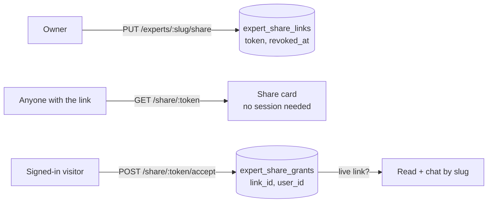

# Sharing an expert

An owner can share an expert with a link. Anyone who opens the link while signed in can
read the expert and ask it questions. They cannot change it, and they never see anyone
else's chats. It works like "anyone with the link" on a document.

Migration `031_expert_share_links.sql`. Code: `peritus/experts/share_repository.py`,
`peritus/api/routes/sharing.py`, and the read clause in `peritus/experts/repository.py`.
Web: `components/experts/share-panel.tsx` and `app/(marketing)/share/[token]`.

## The model

- **The link is a token, not a slug.** 192 random bits (`secrets.token_urlsafe(24)`).
  A slug comes from the topic (`thomism`, `thomism-2`), so it is guessable. The old
  `unlisted` visibility, "anyone with the slug", was removed for that reason.
- **Opening the link records a grant.** For someone who does not own the expert, read
  access means holding a grant on a *live* link: `_granted_clause` joins through
  `expert_share_links` and requires `revoked_at IS NULL`. After that the expert resolves by
  slug for that user on every read path (Overview, Sources, graph, chat, picture), with no
  per-route changes.
- **Revocation covers everyone at once.** Resetting the link revokes the old row and
  mints a new token. Stopping sharing revokes the row. In both cases every grant on the old
  row stops matching, and no grant row has to be found or deleted. Turning sharing back on
  mints a new token, so people who held the old link stay out.
- **The grant is recorded by a click, never by rendering the page.** A link-preview
  fetcher or a prefetch cannot add an expert to anyone's workspace.

## What each person can do

| | owner | viewer (holds a grant) | anyone with the link |
|---|---|---|---|
| Share card (`GET /share/{token}`) | yes | yes | yes |
| Overview, Sources, graph, build log | yes | yes | no |
| Ask (conversations, stateless chat) | yes | yes, billed and rate-limited as the viewer | no |
| Their own chats and answer audits | yes | yes | no |
| Other people's chats and answer audits | **no** | **no** | no |
| Rebuild, cancel, sources, avatar, share, delete, build cost | yes | no (404) | no |
| Remove from their workspace (`DELETE /experts/{slug}/access`) | 409 | yes | no |

`ExpertSummary.access` (`"owner"` or `"viewer"`) tells a client which controls to render.
It only affects rendering; every mutating route re-checks ownership itself.

## Privacy between people

- `GET /experts/{slug}/conversations` is scoped to the caller. It used to list every
  conversation on the expert, which leaked between users once an expert was readable by
  more than one person.
- Answer audits store the question, so they are scoped by `AuditScope`: a caller sees
  the trails of their own conversations. The owner also sees stateless answers
  (`POST /experts/{slug}/chat`), which belong to no conversation. Known limit: if a viewer
  uses the stateless endpoint (TUI/CLI), the owner can see that trail.
- The share card has no slug, owner, id or error, and the API never says who shared a link.

## A viewer's chats after revocation

A chat belongs to the person who had it, so it outlives the link it was started through.
Once the link is reset or turned off, `POST /conversations/{id}/messages` returns **403**
("This expert is no longer shared with you"). The transcript stays readable, and the web
chat page renders it read-only without the expert.

## Uploaded sources

Answers quote the passages they cite. A viewer can therefore read parts of anything the
owner uploaded. `ShareState.uploaded_source_count` gives the number of kept uploads, and the
share panel shows it before the link is created. Sharing is not blocked. It is the
owner's call, as it is on other document-sharing products.

## Headers

- `GET /share/{token}`: `Cache-Control: no-store`, so a revoked link stops rendering on
  the next request. `X-Robots-Tag: noindex, nofollow`.
- `GET /share/{token}/picture`: `Cache-Control: public, no-cache` with an ETag, so it is
  revalidated on every use.
- Web `/share/*` and `/api/share/*`: `Referrer-Policy: no-referrer`, so the token never
  reaches a site linked from the page, plus `noindex`. The page sets
  `robots: noindex` and `referrer: no-referrer` in its metadata too.

The anonymous endpoints are not rate-limited. There is nothing to enumerate, and the
web server is the only real caller, so a per-IP limit would throttle every visitor behind
one address.

## API

| method | path | who | returns |
|---|---|---|---|
| GET | `/experts/{slug}/share` | owner | `ShareState` |
| PUT | `/experts/{slug}/share` | owner | `ShareState` (idempotent) |
| POST | `/experts/{slug}/share/reset` | owner | `ShareState` with a new token |
| DELETE | `/experts/{slug}/share` | owner | 204 |
| DELETE | `/experts/{slug}/access` | viewer | 204 (409 for the owner) |
| GET | `/share/{token}` | anyone | `SharedExpert` card, or 404 |
| GET | `/share/{token}/picture` | anyone | image bytes, or 404 |
| POST | `/share/{token}/accept` | signed in | `{slug, access}`; records a grant for a non-owner |
